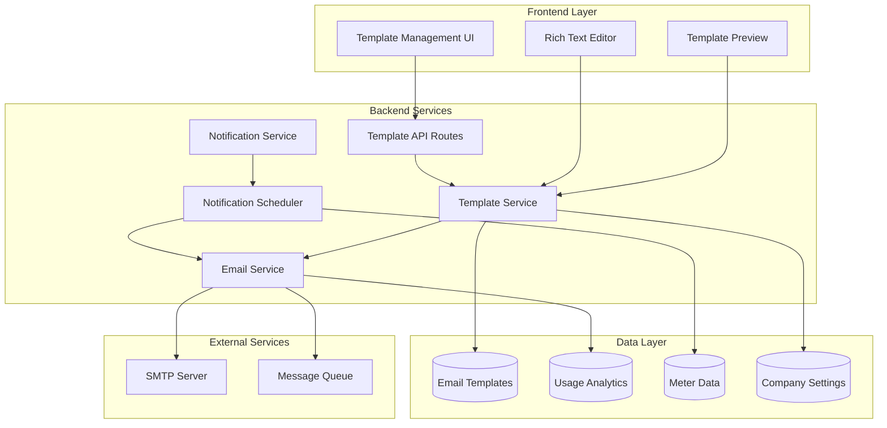

# Design Document

## Overview

The email template system is designed as a comprehensive notification management solution that integrates with the existing meter monitoring infrastructure. The system provides template management capabilities, variable substitution, automated notifications, and usage analytics. The architecture follows a service-oriented approach with clear separation between template management, email delivery, and notification scheduling.

## Architecture



The architecture uses:
- **Express.js REST API** for template management endpoints
- **MongoDB/PostgreSQL** for template storage and analytics
- **Node.js Email Services** with SMTP integration
- **Cron-based Scheduler** for automated notifications
- **Template Engine** for variable substitution and rendering
- **Message Queue** for reliable email delivery

## Components and Interfaces

### Template Management Service
**Purpose:** Handles CRUD operations for email templates and manages template categories.

**Key Components:**
- `TemplateService` - Core business logic for template operations
- `TemplateValidator` - Validates template syntax and variables
- `TemplateRenderer` - Renders templates with variable substitution
- `DefaultTemplateSeeder` - Creates default templates on system initialization

**Template Service Interface:**
```typescript
interface TemplateService {
  createTemplate(template: CreateTemplateRequest): Promise<EmailTemplate>;
  updateTemplate(id: string, updates: UpdateTemplateRequest): Promise<EmailTemplate>;
  deleteTemplate(id: string): Promise<void>;
  getTemplate(id: string): Promise<EmailTemplate>;
  listTemplates(filters: TemplateFilters): Promise<PaginatedTemplates>;
  renderTemplate(id: string, variables: TemplateVariables): Promise<RenderedTemplate>;
  validateTemplate(template: TemplateContent): Promise<ValidationResult>;
  seedDefaultTemplates(): Promise<void>;
}

interface EmailTemplate {
  id: string;
  name: string;
  subject: string;
  content: string;
  category: TemplateCategory;
  variables: TemplateVariable[];
  isDefault: boolean;
  usageCount: number;
  lastUsed?: Date;
  createdAt: Date;
  updatedAt: Date;
}

enum TemplateCategory {
  METER_READINGS = 'meter_readings',
  METER_ERRORS = 'meter_errors',
  MAINTENANCE = 'maintenance',
  GENERAL = 'general'
}
```

### Email Delivery Service
**Purpose:** Handles email composition, delivery, and tracking with retry mechanisms.

**Key Components:**
- `EmailService` - Core email sending functionality
- `EmailComposer` - Composes emails from templates and data
- `DeliveryTracker` - Tracks email delivery status and analytics
- `RetryManager` - Handles failed delivery retries with exponential backoff

**Email Service Interface:**
```typescript
interface EmailService {
  sendEmail(request: EmailRequest): Promise<EmailResult>;
  sendTemplatedEmail(request: TemplatedEmailRequest): Promise<EmailResult>;
  trackDelivery(emailId: string): Promise<DeliveryStatus>;
  retryFailedEmails(): Promise<RetryResult[]>;
  getDeliveryAnalytics(filters: AnalyticsFilters): Promise<EmailAnalytics>;
}

interface EmailRequest {
  to: string[];
  cc?: string[];
  bcc?: string[];
  subject: string;
  htmlContent: string;
  textContent?: string;
  attachments?: EmailAttachment[];
}

interface TemplatedEmailRequest {
  templateId: string;
  to: string[];
  variables: TemplateVariables;
  cc?: string[];
  bcc?: string[];
}

interface EmailResult {
  id: string;
  status: 'sent' | 'failed' | 'queued';
  messageId?: string;
  error?: string;
  sentAt?: Date;
}
```

### Notification Scheduler Service
**Purpose:** Manages automated notifications based on meter data and system events.

**Key Components:**
- `NotificationScheduler` - Schedules and triggers automated notifications
- `MeterDataAnalyzer` - Analyzes meter data for notification triggers
- `NotificationRuleEngine` - Evaluates rules for when to send notifications
- `NotificationQueue` - Manages queued notifications and delivery timing

**Scheduler Interface:**
```typescript
interface NotificationScheduler {
  scheduleNotification(notification: ScheduledNotification): Promise<void>;
  cancelNotification(id: string): Promise<void>;
  processScheduledNotifications(): Promise<ProcessResult>;
  analyzeMeterData(): Promise<NotificationTrigger[]>;
  evaluateNotificationRules(): Promise<RuleEvaluation[]>;
}

interface ScheduledNotification {
  id: string;
  templateId: string;
  recipients: string[];
  triggerType: NotificationTrigger;
  scheduledAt: Date;
  variables: TemplateVariables;
  retryCount: number;
  status: 'pending' | 'sent' | 'failed' | 'cancelled';
}

enum NotificationTrigger {
  METER_NOT_RESPONDING = 'meter_not_responding',
  MONTHLY_READING_SUMMARY = 'monthly_reading_summary',
  MAINTENANCE_DUE = 'maintenance_due',
  MANUAL_TRIGGER = 'manual_trigger'
}
```

### Frontend Template Management
**Purpose:** Provides user interface for template creation, editing, and management.

**Key Components:**
- `TemplateList` - Displays templates with filtering and search
- `TemplateEditor` - Rich text editor with variable insertion
- `TemplatePreview` - Live preview with sample data
- `VariableSelector` - Helper for inserting template variables
- `UsageAnalytics` - Dashboard showing template usage statistics

**Frontend Interface:**
```typescript
interface TemplateManagementProps {
  templates: EmailTemplate[];
  categories: TemplateCategory[];
  variables: AvailableVariables;
  onCreateTemplate: (template: CreateTemplateRequest) => void;
  onUpdateTemplate: (id: string, updates: UpdateTemplateRequest) => void;
  onDeleteTemplate: (id: string) => void;
  onPreviewTemplate: (template: TemplateContent, variables: TemplateVariables) => void;
}

interface TemplateEditorProps {
  template?: EmailTemplate;
  availableVariables: TemplateVariable[];
  onSave: (template: TemplateContent) => void;
  onPreview: (content: string, variables: TemplateVariables) => void;
}
```

## Data Models

### Core Template Models

```typescript
// Email Template Entity
interface EmailTemplate {
  id: string;
  name: string;
  subject: string;
  content: string;
  category: TemplateCategory;
  variables: TemplateVariable[];
  isDefault: boolean;
  isActive: boolean;
  usageCount: number;
  lastUsed?: Date;
  createdBy: string;
  createdAt: Date;
  updatedAt: Date;
}

// Template Variables
interface TemplateVariable {
  name: string;
  description: string;
  type: VariableType;
  required: boolean;
  defaultValue?: string;
  format?: string;
}

enum VariableType {
  TEXT = 'text',
  NUMBER = 'number',
  DATE = 'date',
  BOOLEAN = 'boolean',
  ARRAY = 'array',
  OBJECT = 'object'
}

// Template Categories
enum TemplateCategory {
  METER_READINGS = 'meter_readings',
  METER_ERRORS = 'meter_errors', 
  MAINTENANCE = 'maintenance',
  GENERAL = 'general'
}
```

### Email Delivery Models

```typescript
// Email Delivery Record
interface EmailDelivery {
  id: string;
  templateId?: string;
  recipients: EmailRecipient[];
  subject: string;
  content: string;
  status: DeliveryStatus;
  sentAt?: Date;
  deliveredAt?: Date;
  openedAt?: Date;
  clickedAt?: Date;
  errorMessage?: string;
  retryCount: number;
  messageId?: string;
  createdAt: Date;
}

interface EmailRecipient {
  email: string;
  type: 'to' | 'cc' | 'bcc';
  status: 'pending' | 'sent' | 'delivered' | 'failed' | 'bounced';
}

enum DeliveryStatus {
  QUEUED = 'queued',
  SENDING = 'sending',
  SENT = 'sent',
  DELIVERED = 'delivered',
  FAILED = 'failed',
  BOUNCED = 'bounced'
}
```

### Notification Models

```typescript
// Scheduled Notification
interface ScheduledNotification {
  id: string;
  templateId: string;
  triggerType: NotificationTrigger;
  triggerData: NotificationTriggerData;
  recipients: NotificationRecipient[];
  scheduledAt: Date;
  processedAt?: Date;
  status: NotificationStatus;
  variables: TemplateVariables;
  retryCount: number;
  maxRetries: number;
  createdAt: Date;
}

interface NotificationRecipient {
  email: string;
  name?: string;
  role?: string;
}

interface NotificationTriggerData {
  meterId?: string;
  buildingId?: string;
  equipmentId?: string;
  errorCode?: string;
  readingValue?: number;
  timeRange?: DateRange;
}

enum NotificationStatus {
  PENDING = 'pending',
  PROCESSING = 'processing',
  SENT = 'sent',
  FAILED = 'failed',
  CANCELLED = 'cancelled'
}
```

## Default Templates

### Template 1: Total Meter Reading (30 Days)
**Purpose:** Monthly summary of meter readings for facility managers.

```html
Subject: Monthly Meter Reading Summary - {{building_name}}

<h2>Monthly Meter Reading Summary</h2>
<p>Dear {{recipient_name}},</p>

<p>Here is the meter reading summary for <strong>{{building_name}}</strong> for the period from {{start_date}} to {{end_date}}:</p>

<table>
  <tr>
    <th>Meter ID</th>
    <th>Type</th>
    <th>Total Usage</th>
    <th>Previous Month</th>
    <th>Change</th>
  </tr>
  {{#each meters}}
  <tr>
    <td>{{meter_id}}</td>
    <td>{{meter_type}}</td>
    <td>{{total_usage}} {{units}}</td>
    <td>{{previous_usage}} {{units}}</td>
    <td class="{{change_class}}">{{usage_change}}%</td>
  </tr>
  {{/each}}
</table>

<p><strong>Summary:</strong></p>
<ul>
  <li>Total meters monitored: {{total_meters}}</li>
  <li>Total consumption: {{total_consumption}} {{primary_units}}</li>
  <li>Average daily usage: {{average_daily}} {{primary_units}}</li>
  <li>Month-over-month change: {{monthly_change}}%</li>
</ul>

<p>If you have any questions about these readings, please contact our support team.</p>

<p>Best regards,<br>{{company_name}} Monitoring Team</p>
```

**Variables:**
- `recipient_name`, `building_name`, `start_date`, `end_date`
- `meters` (array), `total_meters`, `total_consumption`, `average_daily`
- `monthly_change`, `company_name`, `primary_units`

### Template 2: Meter Not Responding
**Purpose:** Alert notification when meters fail to respond or report errors.

```html
Subject: ALERT: Meter Not Responding - {{meter_id}} at {{building_name}}

<h2 style="color: #d32f2f;">Meter Communication Alert</h2>
<p>Dear {{recipient_name}},</p>

<p><strong>Alert:</strong> Meter {{meter_id}} at {{building_name}} has stopped responding.</p>

<div style="background: #fff3cd; padding: 15px; border-left: 4px solid #ffc107;">
  <h3>Meter Details:</h3>
  <ul>
    <li><strong>Meter ID:</strong> {{meter_id}}</li>
    <li><strong>Location:</strong> {{building_name}} - {{equipment_location}}</li>
    <li><strong>Type:</strong> {{meter_type}}</li>
    <li><strong>Last Communication:</strong> {{last_communication}}</li>
    <li><strong>Error Duration:</strong> {{error_duration}}</li>
  </ul>
</div>

<h3>Recommended Actions:</h3>
<ol>
  <li>Check physical meter connection and power supply</li>
  <li>Verify network connectivity to the meter</li>
  <li>Review meter configuration settings</li>
  <li>Contact technical support if issue persists</li>
</ol>

<p><strong>Error Code:</strong> {{error_code}}<br>
<strong>Error Description:</strong> {{error_description}}</p>

<p>This alert was generated automatically. Please investigate and resolve the issue promptly to ensure continuous monitoring.</p>

<p>For technical support, contact: {{support_email}} or {{support_phone}}</p>

<p>Best regards,<br>{{company_name}} Monitoring System</p>
```

**Variables:**
- `recipient_name`, `meter_id`, `building_name`, `equipment_location`
- `meter_type`, `last_communication`, `error_duration`, `error_code`
- `error_description`, `support_email`, `support_phone`, `company_name`

### Template 3: Meter Maintenance Reminder
**Purpose:** Scheduled maintenance reminders for meter upkeep and calibration.

```html
Subject: Maintenance Reminder: {{meter_id}} - Due {{due_date}}

<h2>Scheduled Maintenance Reminder</h2>
<p>Dear {{recipient_name}},</p>

<p>This is a reminder that maintenance is due for meter {{meter_id}} at {{building_name}}.</p>

<div style="background: #e3f2fd; padding: 15px; border-left: 4px solid #2196f3;">
  <h3>Maintenance Details:</h3>
  <ul>
    <li><strong>Meter ID:</strong> {{meter_id}}</li>
    <li><strong>Location:</strong> {{building_name}} - {{equipment_location}}</li>
    <li><strong>Maintenance Type:</strong> {{maintenance_type}}</li>
    <li><strong>Due Date:</strong> {{due_date}}</li>
    <li><strong>Last Maintenance:</strong> {{last_maintenance_date}}</li>
    <li><strong>Maintenance Interval:</strong> {{maintenance_interval}}</li>
  </ul>
</div>

<h3>Maintenance Checklist:</h3>
<ul>
  {{#each maintenance_tasks}}
  <li>{{task_description}}</li>
  {{/each}}
</ul>

<h3>Scheduling Information:</h3>
<p><strong>Recommended Service Window:</strong> {{service_window}}<br>
<strong>Estimated Duration:</strong> {{estimated_duration}}<br>
<strong>Required Tools:</strong> {{required_tools}}</p>

<p><strong>Notes:</strong> {{maintenance_notes}}</p>

<p>Please schedule this maintenance within the next {{grace_period}} days to ensure optimal meter performance and accuracy.</p>

<p>To schedule maintenance or for questions, contact: {{maintenance_contact}}</p>

<p>Best regards,<br>{{company_name}} Maintenance Team</p>
```

**Variables:**
- `recipient_name`, `meter_id`, `building_name`, `equipment_location`
- `maintenance_type`, `due_date`, `last_maintenance_date`, `maintenance_interval`
- `maintenance_tasks` (array), `service_window`, `estimated_duration`
- `required_tools`, `maintenance_notes`, `grace_period`, `maintenance_contact`, `company_name`

## Variable System

### Variable Categories
**Meter Variables:**
- `meter_id`, `meter_type`, `meter_status`, `last_reading`, `reading_timestamp`
- `total_usage`, `usage_change`, `error_code`, `error_description`

**Location Variables:**
- `building_name`, `building_address`, `equipment_location`, `facility_manager`

**Time Variables:**
- `current_date`, `start_date`, `end_date`, `due_date`, `last_communication`
- `error_duration`, `maintenance_interval`

**Company Variables:**
- `company_name`, `company_logo`, `support_email`, `support_phone`
- `maintenance_contact`, `website_url`

**Recipient Variables:**
- `recipient_name`, `recipient_email`, `recipient_role`

### Variable Processing
- **Type Validation:** Ensures variables match expected data types
- **Format Conversion:** Applies formatting for dates, numbers, and currencies
- **Default Values:** Provides fallback values for missing data
- **Conditional Logic:** Supports if/else statements and loops in templates
- **Sanitization:** Prevents XSS attacks in user-provided content

## Error Handling

### Template Validation Errors
- **Syntax Errors:** Invalid template syntax or malformed variables
- **Missing Variables:** Required variables not provided during rendering
- **Type Mismatches:** Variable data doesn't match expected type
- **Circular References:** Variables that reference themselves

### Email Delivery Errors
- **SMTP Errors:** Connection failures, authentication issues
- **Recipient Errors:** Invalid email addresses, bounced emails
- **Content Errors:** Malformed HTML, oversized attachments
- **Rate Limiting:** Too many emails sent in short period

### System Errors
- **Database Errors:** Connection failures, query timeouts
- **Service Unavailability:** External service dependencies down
- **Resource Exhaustion:** Memory or disk space limitations
- **Configuration Errors:** Invalid SMTP or system settings

### Error Recovery Strategies
- **Retry Mechanisms:** Exponential backoff for transient failures
- **Fallback Templates:** Use default templates when custom ones fail
- **Graceful Degradation:** Continue operation with reduced functionality
- **Error Notifications:** Alert administrators of system issues

## Testing Strategy

### Unit Testing
- **Template Service:** CRUD operations, validation, rendering
- **Email Service:** Composition, delivery, tracking
- **Variable Processing:** Type validation, formatting, substitution
- **Notification Rules:** Trigger evaluation, scheduling logic

### Integration Testing
- **API Endpoints:** Template management REST API
- **Database Operations:** Template storage and retrieval
- **Email Integration:** SMTP server communication
- **Scheduler Integration:** Cron job execution and notification processing

### End-to-End Testing
- **Template Workflow:** Create, edit, preview, send templates
- **Automated Notifications:** Meter data triggers and email delivery
- **Error Scenarios:** Failed deliveries, invalid templates, system errors
- **Performance Testing:** High-volume email sending, concurrent users