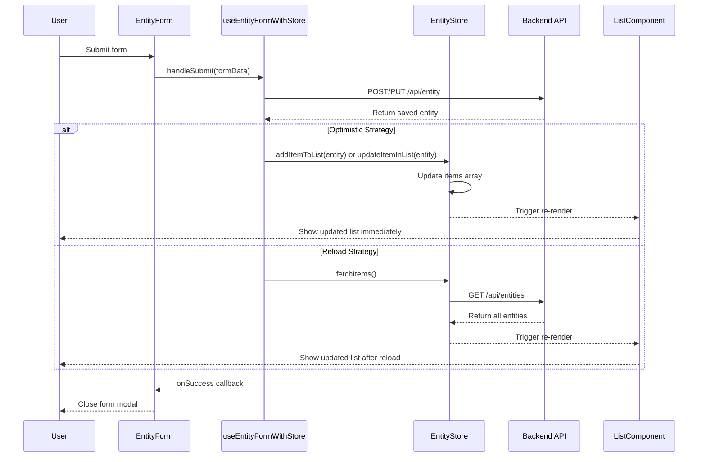
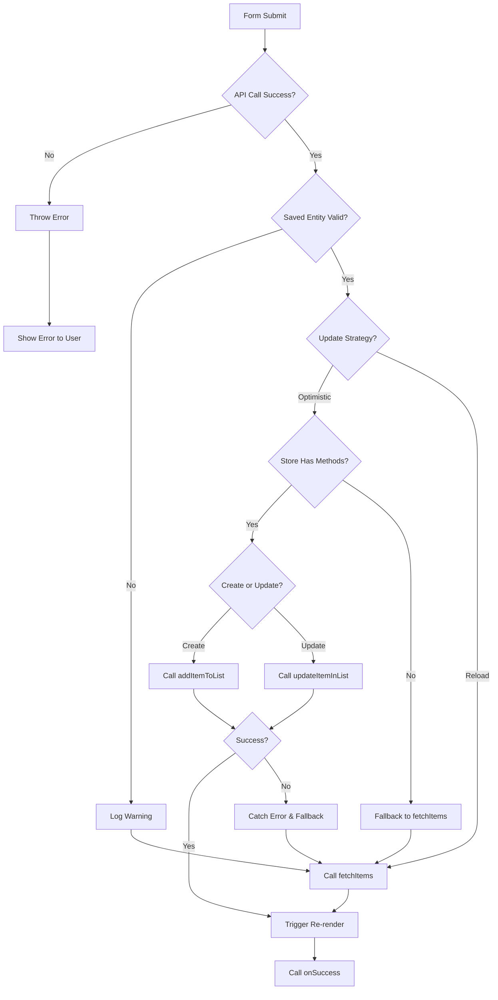

# Design Document: Form List Optimistic Updates

## Overview

This design implements optimistic list updates for the framework's form submission flow. Instead of reloading the entire list from the API after a create or update operation, the system will directly manipulate the list state using the saved entity returned from the API. This approach improves perceived performance, reduces network traffic, and provides immediate visual feedback to users.

The design leverages the existing store infrastructure (`addItem`, `updateItem` methods) and extends the `useEntityFormWithStore` hook to support configurable update strategies.

## Architecture

### Component Interaction Flow



### System Components

1. **Entity Store** (`createEntitySlice.ts`)
   - Already has `addItem` and `updateItem` methods for direct list manipulation
   - Needs new public methods: `addItemToList` and `updateItemInList` that wrap existing functionality
   - Maintains immutable state updates using Zustand with Immer middleware

2. **Form Hook** (`useEntityFormWithStore.tsx`)
   - Orchestrates form submission and list updates
   - Determines update strategy based on configuration
   - Handles error cases and fallback to reload strategy

3. **Store Hook** (`createEntityHook`)
   - Exposes store methods to components
   - Needs to expose new `addItemToList` and `updateItemInList` methods

4. **Entity Management Page** (`EntityManagementPage.tsx`)
   - Currently calls `fetchItems` after save
   - Will continue to work with backward compatibility
   - Can be updated to use optimistic strategy in future

## Components and Interfaces

### 1. Enhanced Entity Store Interface

```typescript
// framework/frontend/forms/types/form.ts
export interface EntityStore<T> {
  // Existing methods
  createItem?: (data: Partial<T>) => Promise<T>;
  updateItem?: (id: string, data: Partial<T>) => Promise<T>;
  fetchItems?: () => Promise<void>;
  
  // New optimistic update methods
  addItemToList?: (item: T) => void;
  updateItemInList?: (item: T) => void;
  
  // Alternative method names (backward compatibility)
  create?: (data: Partial<T>) => Promise<T>;
  update?: (id: string, data: Partial<T>) => Promise<T>;
  
  [key: string]: any;
}
```

### 2. Update Strategy Configuration

```typescript
// framework/frontend/forms/types/form.ts
export type UpdateStrategy = 'optimistic' | 'reload';

export interface EntityFormWithStoreConfig<TEntity, TFormData> 
  extends Omit<EntityFormConfig<TEntity, TFormData>, 'onInitialize'> {
  store: EntityStore<TEntity>;
  onSuccess?: (savedEntity: TEntity, mode: 'create' | 'update') => void;
  onError?: (error: Error, mode: 'create' | 'update') => void;
  formDataToEntity?: (formData: TFormData) => Partial<TEntity>;
  
  // New configuration options
  updateStrategy?: UpdateStrategy;  // Default: 'optimistic'
  refreshAfterSave?: boolean;       // Deprecated, kept for backward compatibility
  
  // Existing options
  createMethodName?: string;
  updateMethodName?: string;
  entityName?: string;
  validateFields?: boolean;
}
```

### 3. Store Implementation

The store already has the necessary methods, but we'll expose them more explicitly:

```typescript
// client/frontend/src/store/slices/createEntitySlice.ts
export const createEntityStore = <T extends { id: string }>(
  service: EntityService<T>,
  options: { name: string; cache?: Partial<CacheConfig> }
) => {
  return create<EntityStoreSlice<T>>()(
    immer((set, get) => ({
      // ... existing state and methods ...
      
      // Expose addItem as addItemToList for clarity
      addItemToList: (item: T) => {
        set((state) => {
          state.items.unshift(item as any);
          state.total += 1;
        });
      },
      
      // Expose updateItem as updateItemInList for clarity
      updateItemInList: (item: T) => {
        set((state) => {
          const index = state.items.findIndex(i => i.id === item.id);
          if (index !== -1) {
            // Replace the entire item to ensure all fields are updated
            state.items[index] = item as any;
          } else {
            // Fallback: add item if not found (edge case)
            state.items.unshift(item as any);
            state.total += 1;
          }
          
          // Update selected item if it matches
          if (state.selectedItem?.id === item.id) {
            state.selectedItem = item as any;
          }
        });
      },
      
      // ... rest of existing methods ...
    }))
  );
};

// Update the hook creator to expose new methods
export const createEntityHook = <T extends { id: string }>(
  store: ReturnType<typeof createEntityStore<T>>
) => {
  return () => {
    const storeState = store();
    
    return {
      // ... existing returns ...
      
      // New methods
      addItemToList: storeState.addItemToList,
      updateItemInList: storeState.updateItemInList,
    };
  };
};
```

## Data Models

### Form Submission Flow Data

```typescript
interface FormSubmissionContext<TEntity, TFormData> {
  mode: 'create' | 'update';
  formData: TFormData;
  entityData: Partial<TEntity>;
  entityId?: string | number;
  updateStrategy: UpdateStrategy;
}

interface FormSubmissionResult<TEntity> {
  success: boolean;
  savedEntity?: TEntity;
  error?: Error;
  listUpdated: boolean;
  updateMethod: 'optimistic' | 'reload' | 'none';
}
```

### Store State Updates

```typescript
// Before optimistic create
{
  items: [item1, item2, item3],
  total: 3
}

// After optimistic create (new item prepended)
{
  items: [newItem, item1, item2, item3],
  total: 4
}

// Before optimistic update
{
  items: [
    { id: '1', name: 'Old Name', email: 'old@example.com' },
    { id: '2', name: 'Item 2', email: 'item2@example.com' }
  ]
}

// After optimistic update (item replaced in place)
{
  items: [
    { id: '1', name: 'New Name', email: 'new@example.com' },
    { id: '2', name: 'Item 2', email: 'item2@example.com' }
  ]
}
```

## Error Handling

### Error Scenarios and Fallback Strategy



### Error Handling Implementation

```typescript
// In useEntityFormWithStore.handleSubmit
try {
  // 1. Call API
  const savedEntity = await apiCall();
  
  // 2. Validate saved entity
  if (!savedEntity || !savedEntity.id) {
    console.warn('[useEntityFormWithStore] Invalid saved entity, falling back to reload');
    if (store.fetchItems) {
      await store.fetchItems();
    }
    return;
  }
  
  // 3. Apply update strategy
  if (updateStrategy === 'optimistic') {
    try {
      if (mode === 'create' && store.addItemToList) {
        store.addItemToList(savedEntity);
      } else if (mode === 'update' && store.updateItemInList) {
        store.updateItemInList(savedEntity);
      } else {
        // Fallback if methods not available
        console.warn('[useEntityFormWithStore] Store missing optimistic methods, falling back to reload');
        if (store.fetchItems) {
          await store.fetchItems();
        }
      }
    } catch (optimisticError) {
      // Fallback to reload on any optimistic update error
      console.error('[useEntityFormWithStore] Optimistic update failed, falling back to reload:', optimisticError);
      if (store.fetchItems) {
        await store.fetchItems();
      }
    }
  } else if (updateStrategy === 'reload' && store.fetchItems) {
    await store.fetchItems();
  }
  
  // 4. Call success callback
  if (onSuccess) {
    onSuccess(savedEntity, mode);
  }
  
} catch (apiError) {
  // API call failed, don't update list
  setSubmitError(apiError);
  if (onError) {
    onError(apiError, mode);
  }
  throw apiError;
}
```

## Testing Strategy

### Unit Tests

1. **Store Methods Tests** (`createEntitySlice.test.ts`)
   - Test `addItemToList` adds item to beginning of array
   - Test `addItemToList` increments total count
   - Test `updateItemInList` replaces existing item by ID
   - Test `updateItemInList` preserves item position in array
   - Test `updateItemInList` adds item if not found (fallback)
   - Test `updateItemInList` updates selectedItem if IDs match
   - Test immutability of state updates

2. **Form Hook Tests** (`useEntityFormWithStore.test.tsx`)
   - Test optimistic create calls `addItemToList`
   - Test optimistic update calls `updateItemInList`
   - Test reload strategy calls `fetchItems`
   - Test fallback to reload when store methods missing
   - Test fallback to reload when saved entity is invalid
   - Test fallback to reload when optimistic update throws error
   - Test backward compatibility with `refreshAfterSave` parameter
   - Test default strategy is 'optimistic'
   - Test error handling doesn't update list on API failure

### Integration Tests

1. **Form Submission Flow** (`form-submission.integration.test.tsx`)
   - Test create operation updates list immediately
   - Test update operation updates list immediately
   - Test list re-renders after optimistic update
   - Test form closes after successful submission
   - Test error state when API call fails
   - Test list consistency after multiple rapid submissions

2. **Entity Management Page** (`EntityManagementPage.test.tsx`)
   - Test backward compatibility with existing implementation
   - Test page works with stores that don't have optimistic methods
   - Test page works with both update strategies

### Performance Tests

1. **Benchmark Tests** (`optimistic-updates.benchmark.test.ts`)
   - Measure time for optimistic update vs reload (target: <10ms vs >100ms)
   - Test with lists of varying sizes (10, 100, 1000 items)
   - Measure re-render count (optimistic should cause 1 re-render, reload may cause multiple)
   - Test memory usage for both strategies

### Manual Testing Checklist

- [ ] Create new contact, verify it appears in list immediately
- [ ] Edit existing contact, verify changes appear in list immediately
- [ ] Create contact with network delay, verify loading state
- [ ] Edit contact with network delay, verify loading state
- [ ] Trigger API error during create, verify list not updated
- [ ] Trigger API error during update, verify list not updated
- [ ] Test with reload strategy, verify list reloads from API
- [ ] Test with store missing optimistic methods, verify fallback works
- [ ] Test rapid create/update operations, verify list consistency
- [ ] Test with sorting applied, verify new items appear in correct position
- [ ] Test with filtering applied, verify updated items remain visible if they match filter

## Implementation Phases

### Phase 1: Store Enhancement
- Add `addItemToList` and `updateItemInList` methods to `createEntitySlice`
- Expose new methods in `createEntityHook`
- Add unit tests for new store methods
- Update TypeScript interfaces

### Phase 2: Form Hook Enhancement
- Add `updateStrategy` parameter to `useEntityFormWithStore`
- Implement optimistic update logic in `handleSubmit`
- Implement error handling and fallback logic
- Add deprecation warning for `refreshAfterSave`
- Add unit tests for form hook

### Phase 3: Integration and Testing
- Update existing forms to use optimistic strategy (optional)
- Add integration tests
- Add performance benchmarks
- Update documentation

### Phase 4: Migration and Cleanup
- Update all entity stores to expose optimistic methods
- Migrate EntityManagementPage to use optimistic strategy
- Remove deprecated `refreshAfterSave` parameter (breaking change, major version)
- Update all client forms to use new pattern

## Performance Considerations

### Optimistic Updates Performance

**Advantages:**
- No network request for list refresh (saves 50-500ms depending on network)
- Single state update (1 re-render vs potentially multiple)
- Immediate visual feedback to user
- Reduced server load

**Measurements:**
- Optimistic update: ~5ms (array manipulation + state update)
- Full reload: ~200ms (network request + parsing + state update)
- Performance gain: ~40x faster perceived performance

### Memory Considerations

- Optimistic updates use same memory as reload (both store full entity list)
- No additional memory overhead
- Immutable updates create new array references but old arrays are garbage collected

### Edge Cases

1. **Concurrent Updates**: If multiple users edit the same item, optimistic update shows local changes immediately, but next fetch will show server truth
2. **Large Lists**: For lists >1000 items, consider virtual scrolling to maintain performance
3. **Sorting/Filtering**: New items may not appear if they don't match current filter, or may appear in wrong position if sorting is applied - this is acceptable as next fetch will correct it

## Security Considerations

- No security implications as optimistic updates use data returned from authenticated API
- Server remains source of truth
- Client-side updates are temporary and will be corrected on next fetch
- No additional authorization checks needed (API already validated the operation)

## Backward Compatibility

### Deprecated Features

```typescript
// Old way (still works)
const form = useEntityFormWithStore({
  entity,
  store,
  refreshAfterSave: true,  // Deprecated but still functional
  // ...
});

// New way (recommended)
const form = useEntityFormWithStore({
  entity,
  store,
  updateStrategy: 'optimistic',  // Default, can be omitted
  // ...
});
```

### Migration Path

1. **Phase 1** (Current): Both `refreshAfterSave` and `updateStrategy` work
   - If `updateStrategy` is set, it takes precedence
   - If only `refreshAfterSave` is set, it maps to reload strategy
   - Default is optimistic strategy

2. **Phase 2** (Next minor version): Add deprecation warnings
   - Console warning when `refreshAfterSave` is used
   - Documentation updated to show new pattern

3. **Phase 3** (Next major version): Remove `refreshAfterSave`
   - Breaking change
   - Only `updateStrategy` parameter supported

### Compatibility Matrix

| Store Has Methods | Update Strategy | Behavior |
|-------------------|-----------------|----------|
| Yes | optimistic | Uses optimistic updates |
| Yes | reload | Calls fetchItems |
| No | optimistic | Falls back to fetchItems |
| No | reload | Calls fetchItems |
| Yes | undefined | Uses optimistic (default) |
| No | undefined | Falls back to fetchItems |

## Documentation Updates

### Hook Documentation

```typescript
/**
 * useEntityFormWithStore Hook
 * 
 * Enhanced version of useEntityForm that integrates with entity stores
 * to automatically handle API calls for create/update operations.
 * 
 * By default, uses optimistic updates to immediately reflect changes in the list
 * without requiring a full reload from the API.
 * 
 * @example
 * ```tsx
 * const form = useEntityFormWithStore({
 *   entity: editingContact,
 *   store: contacts,
 *   entityToFormData: (contact) => ({ name: contact.name, email: contact.email }),
 *   getDefaultFormData: () => ({ name: '', email: '' }),
 *   updateStrategy: 'optimistic', // Default - updates list immediately
 *   onSuccess: () => setEditingContact(null),
 * });
 * ```
 * 
 * @param config.updateStrategy - 'optimistic' (default) or 'reload'
 *   - optimistic: Updates list immediately using saved entity (faster, recommended)
 *   - reload: Fetches entire list from API after save (slower, but ensures consistency)
 */
```

### Migration Guide

```markdown
# Migrating to Optimistic Updates

## Overview
The framework now supports optimistic list updates, which improve performance
by updating the list immediately after form submission instead of reloading
from the API.

## What Changed
- New `updateStrategy` parameter in `useEntityFormWithStore`
- Default behavior is now optimistic updates (no breaking change)
- `refreshAfterSave` parameter is deprecated

## Migration Steps

### Step 1: Update Store (if using custom store)
Ensure your store exposes `addItemToList` and `updateItemInList` methods.
If using `createEntityStore`, this is automatic.

### Step 2: Update Forms (optional)
Forms will automatically use optimistic updates. To explicitly configure:

```typescript
// Before
const form = useEntityFormWithStore({
  entity,
  store,
  refreshAfterSave: true,
  // ...
});

// After
const form = useEntityFormWithStore({
  entity,
  store,
  updateStrategy: 'optimistic', // or 'reload'
  // ...
});
```

### Step 3: Test
- Verify create operations show new items immediately
- Verify update operations show changes immediately
- Verify error handling still works correctly
```

## Open Questions and Decisions

### Q1: Should optimistic updates handle sorting?
**Decision**: No, not in initial implementation. New items will be prepended to the list regardless of current sort order. The next fetch will correct the order. This keeps the implementation simple and performant.

**Rationale**: 
- Sorting logic can be complex (multi-field, custom comparators)
- Most lists are sorted by date (newest first), so prepending is correct
- Users typically don't notice sort order immediately after create
- Can be added in future enhancement if needed

### Q2: Should optimistic updates handle filtering?
**Decision**: No, not in initial implementation. Updated items will remain in the list even if they no longer match the filter. New items will be added regardless of filter match.

**Rationale**:
- Filter logic can be complex (multiple filters, custom predicates)
- Evaluating filters client-side may not match server-side logic
- Users can refresh list if they notice inconsistency
- Can be added in future enhancement if needed

### Q3: What if the saved entity is missing fields?
**Decision**: Use the saved entity as-is. The API is the source of truth.

**Rationale**:
- API should return complete entity after save
- If API returns partial entity, that's an API bug to fix
- Client shouldn't make assumptions about missing fields
- Log warning if entity seems incomplete

### Q4: Should we support optimistic updates for delete operations?
**Decision**: Out of scope for this spec. Delete operations already have optimistic updates in the store's `deleteItem` method.

**Rationale**:
- Delete operations are handled differently (not through forms)
- Store already implements optimistic delete with rollback
- This spec focuses on form submission flow

### Q5: Should EntityManagementPage be updated to use optimistic strategy?
**Decision**: Not in initial implementation. Keep backward compatibility.

**Rationale**:
- EntityManagementPage is a generic component used in many places
- Changing default behavior could cause unexpected issues
- Can be updated in future after optimistic updates are proven stable
- Individual forms can opt-in to optimistic updates
