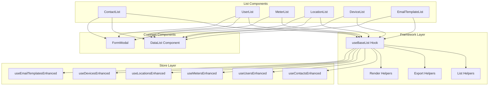

# Design Document

## Overview

The List Component Framework provides a reusable, type-safe foundation for building consistent entity list views across the application. The framework consists of a custom React hook (`useBaseList`) that encapsulates common list functionality, along with helper utilities for rendering, exporting, and managing list state. This design eliminates code duplication across ContactList, UserList, MeterList, LocationList, DeviceList, and EmailTemplateList components while maintaining flexibility for entity-specific customizations.

The framework follows a composition-over-inheritance pattern, using React hooks and configuration objects to provide shared functionality without requiring components to extend a base class.

## Architecture

### High-Level Architecture



### Component Structure

The framework is organized into the following modules:

1. **useBaseList Hook** (`client/frontend/src/hooks/useBaseList.ts`)
   - Core hook that manages list state and operations
   - Provides standardized methods for CRUD, filtering, searching, and bulk actions
   - Type-safe with TypeScript generics

2. **List Helpers** (`client/frontend/src/utils/listHelpers.ts`)
   - Utility functions for common list operations
   - Filter building, search debouncing, unique value extraction

3. **Export Helpers** (`client/frontend/src/utils/exportHelpers.ts`)
   - CSV generation and download functionality
   - Handles special characters, escaping, and formatting

4. **Render Helpers** (`client/frontend/src/utils/renderHelpers.tsx`)
   - Reusable cell renderers for common patterns
   - Status badges, two-line cells, date formatting, etc.

5. **List Types** (`client/frontend/src/types/list.ts`)
   - TypeScript interfaces for framework configuration
   - Extends existing UI types

## Components and Interfaces

### useBaseList Hook

The core hook that provides all list functionality:

```typescript
interface BaseListConfig<T, StoreType> {
  // Entity configuration
  entityName: string; // e.g., 'contact', 'user', 'meter'
  entityNamePlural: string; // e.g., 'contacts', 'users', 'meters'
  
  // Store hook
  useStore: () => StoreType;
  
  // Feature flags (independent of permissions)
  features?: {
    allowCreate?: boolean; // Show create button (default: true)
    allowEdit?: boolean; // Show edit actions (default: true)
    allowDelete?: boolean; // Show delete actions (default: true)
    allowBulkActions?: boolean; // Enable bulk actions (default: true)
    allowExport?: boolean; // Show export functionality (default: true)
    allowImport?: boolean; // Show import functionality (default: false)
    allowSearch?: boolean; // Show search input (default: true)
    allowFilters?: boolean; // Show filter controls (default: true)
    allowStats?: boolean; // Show stats display (default: true)
    allowPagination?: boolean; // Enable pagination (default: true)
    allowSelection?: boolean; // Enable row selection (default: true)
  };
  
  // Permissions (security checks)
  permissions?: {
    create?: Permission;
    read?: Permission;
    update?: Permission;
    delete?: Permission;
  };
  
  // Column definitions
  columns: ColumnDefinition<T>[];
  
  // Filter configuration
  filters?: FilterDefinition[];
  
  // Stats configuration
  stats?: StatDefinition<T>[];
  
  // Bulk actions configuration
  bulkActions?: BulkActionConfig<T>[];
  
  // Export configuration
  export?: ExportConfig<T>;
  
  // Import configuration
  import?: ImportConfig<T>;
  
  // Callbacks
  onEdit?: (item: T) => void;
  onCreate?: () => void;
  onSelect?: (item: T) => void;
}

interface BaseListReturn<T> {
  // State
  searchQuery: string;
  filters: Record<string, any>;
  showExportModal: boolean;
  showImportModal: boolean;
  
  // Setters
  setSearchQuery: (query: string) => void;
  setFilter: (key: string, value: any) => void;
  clearFilters: () => void;
  setShowExportModal: (show: boolean) => void;
  setShowImportModal: (show: boolean) => void;
  
  // Computed values (combines features + permissions)
  canCreate: boolean; // features.allowCreate && hasPermission(create)
  canUpdate: boolean; // features.allowEdit && hasPermission(update)
  canDelete: boolean; // features.allowDelete && hasPermission(delete)
  canExport: boolean; // features.allowExport
  canImport: boolean; // features.allowImport && hasPermission(create)
  canBulkAction: boolean; // features.allowBulkActions
  
  // Handlers
  handleEdit: (item: T) => void;
  handleDelete: (item: T) => void;
  handleCreate: () => void;
  handleExport: (items: T[]) => void;
  handleExportAll: () => void;
  handleImport: (file: File) => Promise<void>;
  
  // Render helpers
  renderFilters: () => ReactNode;
  renderHeaderActions: () => ReactNode;
  renderStats: () => ReactNode;
  renderExportModal: () => ReactNode;
  renderImportModal: () => ReactNode;
  
  // Data
  columns: ColumnDefinition<T>[];
  bulkActions: BulkAction<T>[];
  data: T[];
  loading: boolean;
  error: string | undefined;
  pagination: PaginationConfig;
}
```

### Filter Definition

```typescript
interface FilterDefinition {
  key: string;
  label: string;
  type: 'select' | 'text' | 'date' | 'multiselect';
  options?: FilterOption[] | ((items: any[]) => FilterOption[]);
  placeholder?: string;
  className?: string;
  storeKey?: string; // Maps to store filter key if different
}

interface FilterOption {
  label: string;
  value: any;
}
```

### Stat Definition

```typescript
interface StatDefinition<T> {
  label: string;
  value: (items: T[], store: any) => number | string;
  format?: (value: number | string) => string;
}
```

### Bulk Action Configuration

```typescript
interface BulkActionConfig<T> {
  id: string;
  label: string;
  icon?: string;
  color?: 'primary' | 'secondary' | 'success' | 'warning' | 'error';
  confirm?: boolean;
  confirmMessage?: string | ((items: T[]) => string);
  action: (items: T[], store: any) => Promise<void>;
  requirePermission?: Permission;
}
```

### Export Configuration

```typescript
interface ExportConfig<T> {
  filename: (date: string) => string;
  headers: string[];
  mapRow: (item: T) => any[];
  includeInfo?: string;
}
```

### Import Configuration

```typescript
interface ImportConfig<T> {
  // Template file for users to download
  templateFilename: string;
  templateHeaders: string[];
  
  // Validation
  validateRow: (row: any[], rowIndex: number) => ValidationResult;
  
  // Mapping
  mapRow: (row: any[]) => Partial<T>;
  
  // Processing
  onImport: (items: Partial<T>[]) => Promise<ImportResult>;
  
  // UI
  instructions?: string;
  maxFileSize?: number; // in bytes
  allowedExtensions?: string[]; // default: ['.csv']
}

interface ValidationResult {
  valid: boolean;
  errors?: string[];
}

interface ImportResult {
  success: boolean;
  imported: number;
  failed: number;
  errors?: Array<{ row: number; message: string }>;
}
```

## Data Models

### Enhanced Store Interface

All entity stores should follow this interface pattern:

```typescript
interface EnhancedStore<T> {
  // Data
  items: T[];
  
  // List state
  list: {
    loading: boolean;
    error: string | null;
    page: number;
    pageSize: number;
    total: number;
  };
  
  // Actions
  fetchItems: () => Promise<void>;
  setSearch: (query: string) => void;
  setFilters: (filters: Record<string, any>) => void;
  setPage: (page: number) => void;
  setPageSize: (size: number) => void;
  
  // CRUD operations
  deleteItem?: (id: string) => Promise<void>;
  bulkUpdateStatus?: (ids: string[], status: string) => Promise<void>;
  
  // Computed values (entity-specific)
  [key: string]: any;
}
```

### List Component Props

Standardized props interface for all list components:

```typescript
interface BaseListComponentProps<T> {
  onSelect?: (item: T) => void;
  onEdit?: (item: T) => void;
  onCreate?: () => void;
}
```

## Error Handling

### Error Handling Strategy

1. **Store-Level Errors**: Captured in store state and displayed via DataList error prop
2. **Action Errors**: Caught in try-catch blocks, displayed via alerts or toast notifications
3. **Permission Errors**: Silently handled by hiding UI elements
4. **Export Errors**: Caught and displayed via alert with user-friendly message

### Error Display

```typescript
// In useBaseList hook
const handleDelete = useCallback(async (item: T) => {
  if (!canDelete) return;
  
  const confirmed = window.confirm(
    `Are you sure you want to delete ${entityName} "${item.name}"? This action cannot be undone.`
  );
  
  if (confirmed) {
    try {
      await store.deleteItem(item.id);
    } catch (error) {
      const message = error instanceof Error ? error.message : `Failed to delete ${entityName}`;
      alert(message); // TODO: Replace with toast notification
    }
  }
}, [canDelete, entityName, store]);
```

## Testing Strategy

### Unit Tests

1. **useBaseList Hook Tests**
   - Test state management (search, filters, pagination)
   - Test permission checks
   - Test CRUD handlers
   - Test export functionality
   - Test filter rendering

2. **Helper Function Tests**
   - Test CSV generation with special characters
   - Test filter building logic
   - Test unique value extraction
   - Test render helpers output

### Integration Tests

1. **List Component Tests**
   - Test full list component with useBaseList
   - Test user interactions (search, filter, sort)
   - Test bulk actions
   - Test export flow
   - Test CRUD operations

### Test Example

```typescript
describe('useBaseList', () => {
  it('should initialize with default state', () => {
    const { result } = renderHook(() => useBaseList(mockConfig));
    
    expect(result.current.searchQuery).toBe('');
    expect(result.current.filters).toEqual({});
    expect(result.current.showExportModal).toBe(false);
  });
  
  it('should handle search query changes', () => {
    const { result } = renderHook(() => useBaseList(mockConfig));
    
    act(() => {
      result.current.setSearchQuery('test');
    });
    
    expect(result.current.searchQuery).toBe('test');
    expect(mockStore.setSearch).toHaveBeenCalledWith('test');
  });
  
  it('should check permissions correctly', () => {
    const { result } = renderHook(() => useBaseList(mockConfig));
    
    expect(result.current.canCreate).toBe(true);
    expect(result.current.canUpdate).toBe(true);
    expect(result.current.canDelete).toBe(false);
  });
});
```

## Implementation Details

### Phase 1: Core Framework

1. Create type definitions in `client/frontend/src/types/list.ts`
2. Implement helper utilities:
   - `listHelpers.ts` - Filter and search utilities
   - `exportHelpers.ts` - CSV generation
   - `renderHelpers.tsx` - Common cell renderers
3. Implement `useBaseList` hook with core functionality

### Phase 2: Migration Utilities

1. Create migration guide document
2. Implement backward compatibility layer
3. Create example implementations for each list type

### Phase 3: Component Migration

1. Migrate ContactList to use framework
2. Migrate UserList to use framework
3. Migrate LocationList to use framework
4. Migrate MeterList to use framework
5. Migrate DeviceList to use framework
6. Rename and migrate TemplateList to EmailTemplateList

### Phase 4: Refinement

1. Add comprehensive tests
2. Optimize performance (memoization, debouncing)
3. Add documentation and examples
4. Gather feedback and iterate

## Migration Example

### Before (ContactList.tsx)

```typescript
export const ContactList: React.FC<ContactListProps> = ({
  onContactSelect,
  onContactEdit,
  onContactCreate,
}) => {
  const { checkPermission } = useAuth();
  const contacts = useContactsEnhanced();
  
  const [searchQuery, setSearchQuery] = useState('');
  const [roleFilter, setRoleFilter] = useState<string>('');
  // ... 100+ lines of boilerplate
```

### After (ContactList.tsx)

```typescript
export const ContactList: React.FC<ContactListProps> = ({
  onContactSelect,
  onContactEdit,
  onContactCreate,
}) => {
  const baseList = useBaseList<Contact, ReturnType<typeof useContactsEnhanced>>({
    entityName: 'contact',
    entityNamePlural: 'contacts',
    useStore: useContactsEnhanced,
    features: {
      allowCreate: true,
      allowEdit: true,
      allowDelete: true,
      allowBulkActions: true,
      allowExport: true,
      allowImport: false, // Contacts don't support import
      allowSearch: true,
      allowFilters: true,
      allowStats: true,
    },
    permissions: {
      create: Permission.CONTACT_CREATE,
      update: Permission.CONTACT_UPDATE,
      delete: Permission.CONTACT_DELETE,
    },
    columns: contactColumns,
    filters: contactFilters,
    stats: contactStats,
    bulkActions: contactBulkActions,
    export: contactExportConfig,
    onEdit: onContactEdit,
    onCreate: onContactCreate,
  });

  return (
    <div className="contact-list">
      <DataList
        title="Contacts"
        filters={baseList.renderFilters()}
        headerActions={baseList.renderHeaderActions()}
        stats={baseList.renderStats()}
        data={baseList.data}
        columns={baseList.columns}
        loading={baseList.loading}
        error={baseList.error}
        emptyMessage="No contacts found. Create your first contact to get started."
        onEdit={baseList.canUpdate ? baseList.handleEdit : undefined}
        onDelete={baseList.canDelete ? baseList.handleDelete : undefined}
        onSelect={baseList.bulkActions.length > 0 ? () => {} : undefined}
        bulkActions={baseList.bulkActions}
        pagination={baseList.pagination}
      />
      {baseList.renderExportModal()}
      {baseList.renderImportModal()}
    </div>
  );
};
```

### Example: Read-Only List

```typescript
// A simple read-only meter list for a dashboard
const baseList = useBaseList<Meter, ReturnType<typeof useMetersEnhanced>>({
  entityName: 'meter',
  entityNamePlural: 'meters',
  useStore: useMetersEnhanced,
  features: {
    allowCreate: false,
    allowEdit: false,
    allowDelete: false,
    allowBulkActions: false,
    allowExport: true, // Still allow export
    allowStats: true,
  },
  columns: meterColumns,
  stats: meterStats,
  export: meterExportConfig,
});
```

## Feature Flags vs Permissions

The framework distinguishes between **feature flags** and **security permissions**:

### Feature Flags
- Control UI visibility and functionality at the component level
- Independent of user permissions
- Used to enable/disable features for specific list implementations
- Example: A read-only list view might set `allowEdit: false` and `allowDelete: false`

### Security Permissions
- Enforce authorization based on user roles
- Checked via `useAuth().checkPermission()`
- Always take precedence over feature flags
- Example: Even if `allowDelete: true`, delete button won't show if user lacks DELETE permission

### Combined Logic
```typescript
// Final visibility check combines both
const canDelete = (features?.allowDelete ?? true) && checkPermission(permissions?.delete);
const canEdit = (features?.allowEdit ?? true) && checkPermission(permissions?.update);
const canCreate = (features?.allowCreate ?? true) && checkPermission(permissions?.create);
const canExport = (features?.allowExport ?? true); // No permission check needed
const canImport = (features?.allowImport ?? false) && checkPermission(permissions?.create);
```

### Use Cases
1. **Read-only dashboard**: Set `allowEdit: false`, `allowDelete: false`, `allowCreate: false`
2. **Export-only view**: Set `allowEdit: false`, `allowDelete: false`, `allowExport: true`
3. **Simple list**: Set `allowBulkActions: false`, `allowStats: false`
4. **Import-enabled list**: Set `allowImport: true` with import configuration

## Performance Considerations

1. **Memoization**: Use `useMemo` for expensive computations (column definitions, bulk actions, stats)
2. **Debouncing**: Debounce search input (300ms) to reduce API calls
3. **Lazy Loading**: Load filter options on demand for large datasets
4. **Virtual Scrolling**: Consider for lists with 1000+ items (future enhancement)
5. **Code Splitting**: Keep framework bundle size minimal

## Security Considerations

1. **Permission Checks**: Always verify permissions before showing actions or executing operations
2. **XSS Prevention**: Sanitize user input in search and filters
3. **CSV Injection**: Escape special characters in CSV exports
4. **CSRF Protection**: Ensure all API calls include CSRF tokens
5. **Data Validation**: Validate all user inputs before sending to API

## Accessibility

1. **Keyboard Navigation**: Ensure all interactive elements are keyboard accessible
2. **ARIA Labels**: Add appropriate aria-labels to filters, buttons, and actions
3. **Screen Reader Support**: Provide meaningful labels and descriptions
4. **Focus Management**: Manage focus when modals open/close
5. **Color Contrast**: Ensure sufficient contrast for status indicators and badges

## Future Enhancements

1. **Advanced Filtering**: Add support for complex filter expressions (AND/OR logic)
2. **Saved Views**: Allow users to save filter/sort configurations
3. **Column Customization**: Let users show/hide and reorder columns
4. **Batch Operations**: Support for larger batch operations with progress tracking
5. **Real-time Updates**: WebSocket integration for live data updates
6. **Export Formats**: Add support for Excel, PDF exports
7. **Import Functionality**: CSV import with validation and error handling
