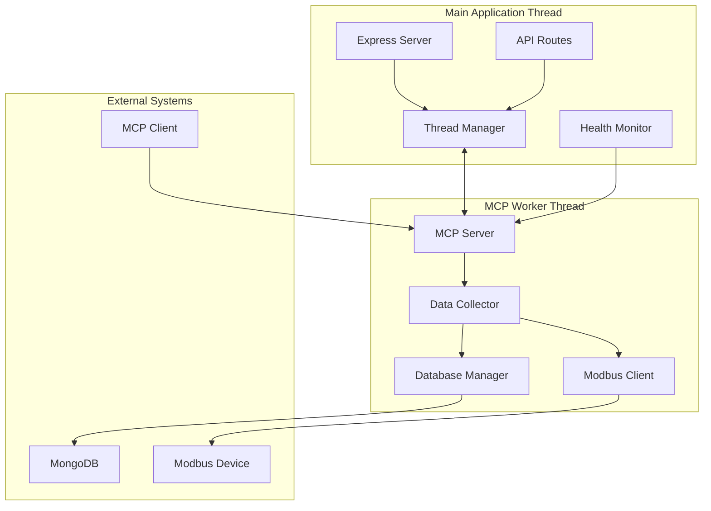

# Design Document

## Overview

This design implements a threaded architecture for the MCP (Model Context Protocol) server to decouple it from the main application thread. The current architecture runs the MCP server as a standalone process communicating via stdio, but this design will integrate it as a threaded component within the main application, providing better resource management and communication efficiency.

The solution uses Node.js Worker Threads to create an isolated execution environment for the MCP server while maintaining safe communication channels with the main application thread.

## Architecture

### Current Architecture
- **Main Application**: Express.js backend server running on main thread
- **MCP Server**: Standalone Node.js process with stdio communication
- **Data Collector**: Runs within MCP server process
- **Communication**: Process-to-process via stdio/IPC

### Proposed Threaded Architecture
- **Main Application Thread**: Express.js backend server
- **MCP Worker Thread**: Isolated thread running MCP server logic
- **Thread Communication**: MessagePort-based bidirectional communication
- **Shared Resources**: Thread-safe database connection pooling
- **Health Monitoring**: Main thread monitors worker thread health



## Components and Interfaces

### 1. Thread Manager (Main Thread)
**Purpose**: Manages the lifecycle of the MCP worker thread and handles communication.

**Key Methods**:
- `startMCPWorker()`: Initialize and start the MCP worker thread
- `stopMCPWorker()`: Gracefully shutdown the worker thread
- `sendMessage(message)`: Send messages to worker thread
- `onMessage(handler)`: Register message handlers from worker thread
- `getWorkerStatus()`: Get current worker thread health status

**Configuration**:
```typescript
interface ThreadManagerConfig {
  maxRestartAttempts: number;
  restartDelay: number;
  healthCheckInterval: number;
  messageTimeout: number;
}
```

### 2. MCP Worker Thread
**Purpose**: Runs the MCP server logic in an isolated thread environment.

**Key Components**:
- **MCP Server Instance**: Handles MCP protocol communication
- **Data Collector**: Manages Modbus data collection
- **Message Handler**: Processes messages from main thread
- **Health Reporter**: Sends periodic health updates

**Worker Interface**:
```typescript
interface WorkerMessage {
  type: 'start' | 'stop' | 'status' | 'config' | 'data';
  payload?: any;
  requestId?: string;
}

interface WorkerResponse {
  type: 'success' | 'error' | 'status' | 'data';
  payload?: any;
  requestId?: string;
}
```

### 3. Health Monitor (Main Thread)
**Purpose**: Monitors worker thread health and handles automatic recovery.

**Key Features**:
- Periodic health checks via ping/pong messages
- Automatic restart on worker thread failure
- Exponential backoff for restart attempts
- Health status reporting to main application

### 4. Communication Layer
**Purpose**: Provides thread-safe communication between main and worker threads.

**Message Types**:
- **Control Messages**: Start, stop, restart worker
- **Configuration Messages**: Update worker configuration
- **Data Messages**: Request data from worker
- **Health Messages**: Health checks and status updates
- **Error Messages**: Error reporting and handling

## Data Models

### Thread Status Model
```typescript
interface ThreadStatus {
  isRunning: boolean;
  startTime: Date;
  lastHealthCheck: Date;
  restartCount: number;
  errorCount: number;
  memoryUsage: {
    rss: number;
    heapUsed: number;
    heapTotal: number;
  };
}
```

### Message Queue Model
```typescript
interface MessageQueue {
  pending: Map<string, PendingMessage>;
  maxSize: number;
  timeout: number;
}

interface PendingMessage {
  message: WorkerMessage;
  resolve: (response: WorkerResponse) => void;
  reject: (error: Error) => void;
  timestamp: Date;
}
```

### Configuration Model
```typescript
interface MCPThreadConfig {
  modbus: ModbusConfig;
  database: DatabaseConfig;
  collection: {
    interval: number;
    autoStart: boolean;
  };
  thread: {
    maxMemory: number;
    maxRestarts: number;
    healthCheckInterval: number;
  };
}
```

## Error Handling

### Worker Thread Errors
1. **Unhandled Exceptions**: Catch and report to main thread
2. **Memory Leaks**: Monitor memory usage and restart if exceeded
3. **Connection Failures**: Implement retry logic with exponential backoff
4. **Communication Timeouts**: Handle message timeouts gracefully

### Main Thread Error Handling
1. **Worker Startup Failures**: Retry with exponential backoff
2. **Communication Failures**: Queue messages and retry
3. **Health Check Failures**: Automatic worker restart
4. **Resource Exhaustion**: Graceful degradation

### Error Recovery Strategies
- **Automatic Restart**: Worker thread restart on critical failures
- **Circuit Breaker**: Temporary disable on repeated failures
- **Fallback Mode**: Basic functionality when worker unavailable
- **Error Reporting**: Comprehensive logging and monitoring

## Testing Strategy

### Unit Tests
- **Thread Manager**: Test worker lifecycle management
- **Message Communication**: Test bidirectional messaging
- **Health Monitoring**: Test health check mechanisms
- **Error Handling**: Test various failure scenarios

### Integration Tests
- **End-to-End Communication**: Test complete message flow
- **Database Operations**: Test thread-safe database access
- **Modbus Communication**: Test Modbus operations in worker thread
- **Concurrent Operations**: Test multiple simultaneous operations

### Performance Tests
- **Memory Usage**: Monitor memory consumption over time
- **Message Throughput**: Test communication performance
- **Thread Overhead**: Compare performance with current architecture
- **Resource Utilization**: Monitor CPU and memory usage

### Stress Tests
- **High Message Volume**: Test with high message throughput
- **Long Running Operations**: Test stability over extended periods
- **Error Injection**: Test recovery from various error conditions
- **Resource Limits**: Test behavior under resource constraints

## Implementation Phases

### Phase 1: Core Threading Infrastructure
- Implement Thread Manager with basic worker lifecycle
- Create Worker Thread wrapper for existing MCP server
- Implement basic message communication
- Add health monitoring foundation

### Phase 2: Enhanced Communication
- Implement request/response message patterns
- Add message queuing and timeout handling
- Create configuration management system
- Add comprehensive error handling

### Phase 3: Integration and Optimization
- Integrate with existing Express.js backend
- Optimize database connection sharing
- Implement performance monitoring
- Add comprehensive logging

### Phase 4: Testing and Hardening
- Implement comprehensive test suite
- Add stress testing and performance benchmarks
- Implement production monitoring
- Add documentation and deployment guides

## Security Considerations

### Thread Isolation
- Worker thread runs in isolated context
- No direct access to main thread variables
- Controlled communication via message passing
- Resource limits to prevent resource exhaustion

### Data Protection
- Sensitive configuration data encrypted in transit
- Database credentials managed securely
- Input validation on all message types
- Audit logging for security events

### Access Control
- Worker thread permissions limited to necessary operations
- Main thread controls worker lifecycle
- Configuration changes require authentication
- Monitoring access restricted to authorized users