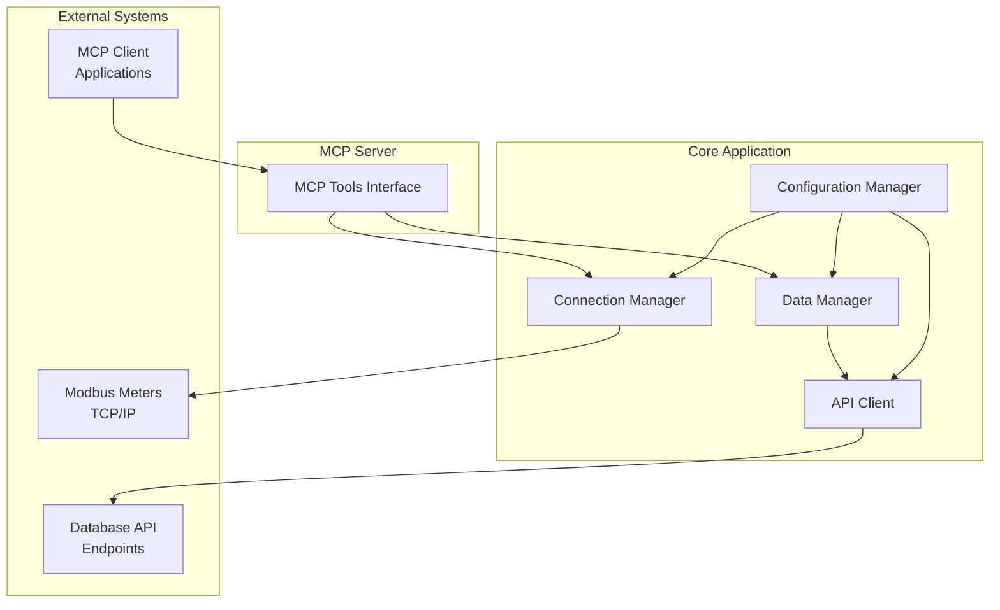

# Design Document

## Overview

The Modbus meter tracking application is designed as a Node.js/TypeScript application that implements an MCP (Model Context Protocol) server. The system follows a modular architecture with clear separation between Modbus communication, data processing, API integration, and MCP server functionality.

## Architecture



The system uses an event-driven architecture where:
- Connection Manager handles all Modbus TCP connections
- Data Manager processes and queues meter readings
- API Client manages database storage with retry logic
- MCP Server exposes tools for external interaction

## Components and Interfaces

### Connection Manager
**Purpose:** Manages TCP connections to Modbus meters and handles data reading operations.

**Key Methods:**
- `addMeter(config: MeterConfig): Promise<void>` - Add new meter configuration
- `removeMeter(meterId: string): Promise<void>` - Remove meter from monitoring
- `readMeter(meterId: string): Promise<MeterReading>` - Read current values from meter
- `getMeterStatus(meterId: string): MeterStatus` - Get connection status

**Configuration Interface:**
```typescript
interface MeterConfig {
  id: string;
  name: string;
  host: string;
  port: number;
  unitId: number;
  registers: RegisterConfig[];
  readInterval: number; // milliseconds
}

interface RegisterConfig {
  address: number;
  type: 'holding' | 'input';
  dataType: 'uint16' | 'int16' | 'uint32' | 'int32' | 'float32';
  name: string;
  unit?: string;
}
```

### Data Manager
**Purpose:** Processes meter readings, manages data queues, and coordinates with API client.

**Key Methods:**
- `processReading(reading: MeterReading): Promise<void>` - Process new meter reading
- `getLatestReading(meterId: string): MeterReading | null` - Get cached latest reading
- `getQueueStatus(): QueueStatus` - Get current queue statistics

**Data Interfaces:**
```typescript
interface MeterReading {
  meterId: string;
  timestamp: Date;
  values: RegisterValue[];
  quality: 'good' | 'uncertain' | 'bad';
}

interface RegisterValue {
  address: number;
  name: string;
  value: number;
  unit?: string;
}
```

### API Client
**Purpose:** Handles HTTP communication with database API endpoints, including retry logic.

**Key Methods:**
- `storeReading(reading: MeterReading): Promise<void>` - Store reading in database
- `getStorageStatus(): StorageStatus` - Get API client status
- `retryFailedRequests(): Promise<void>` - Manually trigger retry of failed requests

**API Payload Format:**
```typescript
interface APIPayload {
  meter_id: string;
  timestamp: string; // ISO 8601
  readings: {
    register_address: number;
    register_name: string;
    value: number;
    unit?: string;
  }[];
  quality: string;
}
```

### MCP Server Tools
**Purpose:** Exposes system functionality through MCP protocol for external clients.

**Available Tools:**
1. `get_meter_readings` - Get current readings from specified meters
2. `get_meter_status` - Get connection status and health of meters
3. `add_meter` - Add new meter configuration
4. `list_meters` - List all configured meters
5. `get_system_status` - Get overall system health and statistics

## Data Models

### Core Data Models

**Meter Configuration Model:**
- Stores meter connection parameters
- Validates IP addresses and port ranges
- Manages register mapping configurations

**Reading Data Model:**
- Timestamped meter readings with quality indicators
- Supports multiple data types (integers, floats)
- Includes metadata for traceability

**Queue Management Model:**
- Failed API requests with retry metadata
- Exponential backoff calculation
- Maximum retry limits and dead letter handling

### Database Schema (API Endpoint)
The system expects the API to handle storage with the following logical schema:

```sql
-- Meters table
CREATE TABLE meters (
    id VARCHAR(50) PRIMARY KEY,
    name VARCHAR(100),
    host VARCHAR(45),
    port INTEGER,
    unit_id INTEGER,
    created_at TIMESTAMP,
    updated_at TIMESTAMP
);

-- Readings table
CREATE TABLE readings (
    id SERIAL PRIMARY KEY,
    meter_id VARCHAR(50) REFERENCES meters(id),
    timestamp TIMESTAMP,
    register_address INTEGER,
    register_name VARCHAR(50),
    value DECIMAL(15,6),
    unit VARCHAR(20),
    quality VARCHAR(20),
    created_at TIMESTAMP
);
```

## Error Handling

### Connection Error Handling
- **TCP Connection Failures:** Exponential backoff retry (1s, 2s, 4s, 8s, max 60s)
- **Modbus Protocol Errors:** Log error, skip reading, continue with next scheduled read
- **Timeout Handling:** 5-second timeout for Modbus operations, retry on timeout

### API Error Handling
- **HTTP 4xx Errors:** Log error, do not retry (client error)
- **HTTP 5xx Errors:** Queue for retry with exponential backoff
- **Network Errors:** Queue for retry, maximum 5 attempts
- **Queue Overflow:** Implement circular buffer, drop oldest failed requests

### MCP Error Handling
- **Invalid Parameters:** Return structured error response with details
- **System Unavailable:** Return appropriate error codes and retry suggestions
- **Tool Execution Errors:** Catch and return formatted error messages

## Testing Strategy

### Unit Testing
- **Connection Manager:** Mock Modbus TCP connections, test error scenarios
- **Data Manager:** Test data processing, queue management, and caching
- **API Client:** Mock HTTP requests, test retry logic and error handling
- **MCP Tools:** Test tool parameter validation and response formatting

### Integration Testing
- **End-to-End Data Flow:** Simulated Modbus server → processing → API storage
- **MCP Server Integration:** Test MCP protocol communication with mock clients
- **Error Recovery:** Test system behavior during various failure scenarios

### Performance Testing
- **Concurrent Connections:** Test multiple meter connections simultaneously
- **Data Throughput:** Validate system performance under high data volume
- **Memory Usage:** Monitor memory consumption during extended operation

## Configuration Management

### Environment Variables
```bash
# Server Configuration
MCP_SERVER_PORT=3000
LOG_LEVEL=info

# Database API Configuration
API_BASE_URL=http://localhost:8080/api
API_TIMEOUT=30000
API_RETRY_MAX_ATTEMPTS=5

# Modbus Configuration
MODBUS_DEFAULT_TIMEOUT=5000
MODBUS_DEFAULT_READ_INTERVAL=30000
MODBUS_MAX_CONCURRENT_CONNECTIONS=10

# Queue Configuration
QUEUE_MAX_SIZE=1000
QUEUE_RETRY_DELAY_BASE=1000
QUEUE_RETRY_DELAY_MAX=60000
```

### Configuration File Support
- JSON configuration file for meter definitions
- Hot-reload capability for configuration changes
- Configuration validation on startup and reload

## Security Considerations

### Network Security
- Input validation for all IP addresses and ports
- Rate limiting for MCP tool calls
- Secure handling of configuration data

### Data Security
- No sensitive data logging (avoid logging full payloads)
- Secure API authentication (API keys, tokens)
- Input sanitization for all external data

## Deployment Architecture

### Containerization
- Docker container with Node.js runtime
- Multi-stage build for optimized image size
- Health check endpoints for container orchestration

### Monitoring and Observability
- Structured logging with correlation IDs
- Metrics collection (connection counts, read success rates, API response times)
- Health check endpoints for system monitoring