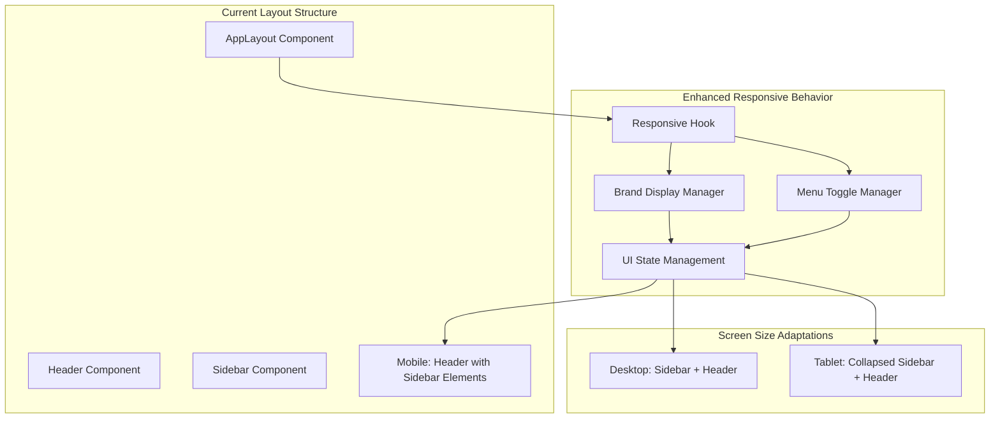

# Design Document

## Overview

The responsive sidebar header feature ensures that essential navigation elements from the sidebar header remain accessible when the browser window is shrunk or on mobile devices. This design integrates the sidebar's brand and menu toggle functionality into the main app header on smaller screens, providing consistent navigation access across all viewport sizes.

## Architecture



The architecture enhances the existing responsive system by:
- **Responsive Detection**: Enhanced viewport monitoring for smooth transitions
- **Element Migration**: Moving sidebar header elements to app header on small screens
- **State Synchronization**: Coordinated state management between header and sidebar
- **Accessibility Preservation**: Maintaining ARIA labels and keyboard navigation

## Components and Interfaces

### Enhanced Header Component
**Purpose:** Displays sidebar header elements when screen size requires it.

**New Props Interface:**
```typescript
interface HeaderProps {
  // Existing props
  title?: string;
  user?: User;
  notifications?: Notification[];
  onLogout: () => void;
  isMobile: boolean;
  
  // New responsive sidebar header props
  showSidebarElements: boolean;
  sidebarBrand?: {
    icon: string;
    text: string;
  };
  onToggleSidebar: () => void;
  sidebarCollapsed: boolean;
}
```

**Enhanced Header Structure:**
```typescript
const Header: React.FC<HeaderProps> = ({
  title,
  user,
  notifications,
  onLogout,
  isMobile,
  showSidebarElements,
  sidebarBrand,
  onToggleSidebar,
  sidebarCollapsed
}) => {
  return (
    <header className="app-header">
      {/* Left side - Sidebar elements when needed */}
      {showSidebarElements && (
        <div className="app-header__left">
          <button
            className="app-header__menu-toggle"
            onClick={onToggleSidebar}
            aria-label={sidebarCollapsed ? 'Open navigation menu' : 'Close navigation menu'}
            aria-expanded={!sidebarCollapsed}
          >
            <HamburgerIcon isOpen={!sidebarCollapsed} />
          </button>
          
          {sidebarBrand && (
            <div className="app-header__brand">
              <span className="brand-icon">{sidebarBrand.icon}</span>
              <span className="brand-text">{sidebarBrand.text}</span>
            </div>
          )}
        </div>
      )}
      
      {/* Center - Page title when sidebar elements are shown */}
      {showSidebarElements && title && (
        <div className="app-header__center">
          <h1 className="app-header__title">{title}</h1>
        </div>
      )}
      
      {/* Right side - User menu and notifications */}
      <div className="app-header__right">
        {/* Existing notification and user menu components */}
      </div>
    </header>
  );
};
```

### Responsive Hook Enhancement
**Purpose:** Provides enhanced responsive detection with sidebar-specific breakpoints.

**Enhanced useResponsive Hook:**
```typescript
interface ResponsiveState {
  isMobile: boolean;
  isTablet: boolean;
  isDesktop: boolean;
  showSidebarInHeader: boolean;
  sidebarBreakpoint: number;
  currentWidth: number;
}

const useResponsive = (): ResponsiveState => {
  const [state, setState] = useState<ResponsiveState>({
    isMobile: false,
    isTablet: false,
    isDesktop: true,
    showSidebarInHeader: false,
    sidebarBreakpoint: 1024,
    currentWidth: window.innerWidth
  });

  useEffect(() => {
    const handleResize = debounce(() => {
      const width = window.innerWidth;
      const isMobile = width < 768;
      const isTablet = width >= 768 && width < 1024;
      const isDesktop = width >= 1024;
      const showSidebarInHeader = width < 1024; // Show sidebar elements in header below desktop

      setState({
        isMobile,
        isTablet,
        isDesktop,
        showSidebarInHeader,
        sidebarBreakpoint: 1024,
        currentWidth: width
      });
    }, 100);

    handleResize();
    window.addEventListener('resize', handleResize);
    return () => window.removeEventListener('resize', handleResize);
  }, []);

  return state;
};
```

### Hamburger Icon Component
**Purpose:** Animated hamburger menu icon with smooth transitions.

**Component Interface:**
```typescript
interface HamburgerIconProps {
  isOpen: boolean;
  className?: string;
}

const HamburgerIcon: React.FC<HamburgerIconProps> = ({ isOpen, className = '' }) => {
  return (
    <div className={`hamburger-icon ${isOpen ? 'open' : ''} ${className}`}>
      <span className="hamburger-line hamburger-line--top" />
      <span className="hamburger-line hamburger-line--middle" />
      <span className="hamburger-line hamburger-line--bottom" />
    </div>
  );
};
```

### Enhanced AppLayout Integration
**Purpose:** Coordinates responsive behavior between header and sidebar.

**Updated AppLayout Logic:**
```typescript
const AppLayout: React.FC<LayoutProps> = ({ children, title, breadcrumbs, loading }) => {
  const { user, logout, checkPermission } = useAuth();
  const location = useLocation();
  const { 
    isMobile, 
    isTablet, 
    isDesktop, 
    showSidebarInHeader 
  } = useResponsive();
  const { 
    sidebarCollapsed, 
    setSidebarCollapsed, 
    mobileNavOpen, 
    setMobileNavOpen 
  } = useUI();

  // Sidebar brand configuration
  const sidebarBrand = {
    icon: '🏢',
    text: 'MeterIt'
  };

  // Enhanced toggle handler
  const handleToggleSidebar = () => {
    if (isMobile) {
      setMobileNavOpen(!mobileNavOpen);
    } else if (isTablet) {
      // On tablet, toggle mobile nav overlay
      setMobileNavOpen(!mobileNavOpen);
    } else {
      // On desktop, toggle sidebar collapse
      setSidebarCollapsed(!sidebarCollapsed);
    }
  };

  return (
    <div className={`app-layout ${getLayoutClasses()}`}>
      <Header
        title={title}
        user={user}
        notifications={[]}
        onLogout={logout}
        isMobile={isMobile}
        showSidebarElements={showSidebarInHeader}
        sidebarBrand={sidebarBrand}
        onToggleSidebar={handleToggleSidebar}
        sidebarCollapsed={sidebarCollapsed || !isDesktop}
      />
      
      {/* Rest of layout components */}
    </div>
  );
};
```

## Data Models

### Responsive State Model
```typescript
interface ResponsiveBreakpoints {
  mobile: number;    // 768px
  tablet: number;    // 1024px
  desktop: number;   // 1440px
}

interface SidebarHeaderConfig {
  brand: {
    icon: string;
    text: string;
    showIcon: boolean;
    showText: boolean;
  };
  toggle: {
    position: 'left' | 'right';
    style: 'hamburger' | 'arrow' | 'custom';
    ariaLabel: string;
  };
  responsive: {
    hideOnDesktop: boolean;
    showInHeaderBelow: number;
    animationDuration: number;
  };
}

interface HeaderLayout {
  left: {
    visible: boolean;
    elements: ('menu-toggle' | 'brand' | 'breadcrumbs')[];
  };
  center: {
    visible: boolean;
    content: 'title' | 'search' | 'breadcrumbs' | null;
  };
  right: {
    visible: boolean;
    elements: ('notifications' | 'user-menu' | 'settings')[];
  };
}
```

### Animation State Model
```typescript
interface TransitionState {
  isTransitioning: boolean;
  fromLayout: 'desktop' | 'tablet' | 'mobile';
  toLayout: 'desktop' | 'tablet' | 'mobile';
  duration: number;
  easing: string;
}

interface ElementTransition {
  element: HTMLElement;
  fromPosition: DOMRect;
  toPosition: DOMRect;
  animationId?: number;
}
```

## Responsive Design Strategy

### Breakpoint System
```css
:root {
  /* Enhanced breakpoint variables */
  --mobile-max: 767px;
  --tablet-min: 768px;
  --tablet-max: 1023px;
  --desktop-min: 1024px;
  --large-min: 1440px;
  
  /* Sidebar header responsive variables */
  --sidebar-header-transition: 0.3s ease-in-out;
  --header-height: 64px;
  --sidebar-width: 280px;
  --sidebar-collapsed-width: 64px;
}
```

### Layout Patterns by Screen Size

**Desktop (≥ 1024px):**
- Persistent sidebar with header containing brand and toggle
- Main app header with title, notifications, and user menu
- Sidebar toggle collapses/expands sidebar in place

**Tablet (768px - 1023px):**
- Sidebar header elements move to main app header
- Menu toggle opens overlay navigation
- Brand appears in app header left side
- Smooth transition animations between layouts

**Mobile (< 768px):**
- Full mobile layout with sidebar elements in app header
- Hamburger menu opens full-screen or drawer navigation
- Optimized touch targets and spacing
- Brand and menu toggle prominently displayed

### CSS Implementation Strategy

**Header Layout Grid:**
```css
.app-header {
  display: grid;
  grid-template-columns: auto 1fr auto;
  grid-template-areas: "left center right";
  align-items: center;
  height: var(--header-height);
  padding: 0 1rem;
  transition: all var(--sidebar-header-transition);
}

.app-header__left {
  grid-area: left;
  display: flex;
  align-items: center;
  gap: 1rem;
}

.app-header__center {
  grid-area: center;
  display: flex;
  justify-content: center;
  align-items: center;
  min-width: 0;
}

.app-header__right {
  grid-area: right;
  display: flex;
  align-items: center;
  gap: 1rem;
}
```

**Responsive Visibility:**
```css
/* Desktop: Hide sidebar elements in header */
@media (min-width: 1024px) {
  .app-header__left {
    display: none;
  }
  
  .app-header {
    grid-template-columns: 1fr auto;
    grid-template-areas: "center right";
  }
}

/* Tablet and Mobile: Show sidebar elements in header */
@media (max-width: 1023px) {
  .app-header__left {
    display: flex;
  }
  
  .sidebar__header {
    display: none;
  }
}
```

**Smooth Transitions:**
```css
.app-header__menu-toggle {
  width: 40px;
  height: 40px;
  border: none;
  background: none;
  cursor: pointer;
  border-radius: 8px;
  transition: all 0.2s ease;
  display: flex;
  align-items: center;
  justify-content: center;
}

.hamburger-icon {
  width: 24px;
  height: 18px;
  position: relative;
  transform: rotate(0deg);
  transition: 0.3s ease-in-out;
}

.hamburger-line {
  display: block;
  position: absolute;
  height: 2px;
  width: 100%;
  background: currentColor;
  border-radius: 1px;
  opacity: 1;
  left: 0;
  transform: rotate(0deg);
  transition: 0.25s ease-in-out;
}

.hamburger-line--top {
  top: 0px;
}

.hamburger-line--middle {
  top: 8px;
}

.hamburger-line--bottom {
  top: 16px;
}

/* Animated hamburger to X transformation */
.hamburger-icon.open .hamburger-line--top {
  top: 8px;
  transform: rotate(135deg);
}

.hamburger-icon.open .hamburger-line--middle {
  opacity: 0;
  left: -60px;
}

.hamburger-icon.open .hamburger-line--bottom {
  top: 8px;
  transform: rotate(-135deg);
}
```

## State Management

### Enhanced UI State
```typescript
interface UIState {
  // Existing state
  sidebarCollapsed: boolean;
  mobileNavOpen: boolean;
  notifications: Notification[];
  
  // New responsive header state
  headerLayout: HeaderLayout;
  showSidebarInHeader: boolean;
  isTransitioning: boolean;
  lastBreakpoint: 'mobile' | 'tablet' | 'desktop';
}

interface UIActions {
  // Existing actions
  setSidebarCollapsed: (collapsed: boolean) => void;
  setMobileNavOpen: (open: boolean) => void;
  
  // New responsive actions
  setHeaderLayout: (layout: HeaderLayout) => void;
  setShowSidebarInHeader: (show: boolean) => void;
  setTransitioning: (transitioning: boolean) => void;
  updateBreakpoint: (breakpoint: 'mobile' | 'tablet' | 'desktop') => void;
}
```

### Responsive State Synchronization
```typescript
const useResponsiveSync = () => {
  const { 
    showSidebarInHeader, 
    setShowSidebarInHeader,
    setTransitioning,
    updateBreakpoint 
  } = useUI();
  
  const { isMobile, isTablet, isDesktop } = useResponsive();

  useEffect(() => {
    const newBreakpoint = isMobile ? 'mobile' : isTablet ? 'tablet' : 'desktop';
    const shouldShowInHeader = !isDesktop;
    
    if (shouldShowInHeader !== showSidebarInHeader) {
      setTransitioning(true);
      setShowSidebarInHeader(shouldShowInHeader);
      updateBreakpoint(newBreakpoint);
      
      // End transition after animation completes
      setTimeout(() => setTransitioning(false), 300);
    }
  }, [isMobile, isTablet, isDesktop, showSidebarInHeader]);
};
```

## Error Handling

### Responsive Transition Errors
- **Layout Shift Prevention**: Use CSS containment and will-change properties
- **Animation Interruption**: Handle rapid resize events with debouncing
- **State Inconsistency**: Validate state transitions and provide fallbacks
- **Memory Leaks**: Proper cleanup of resize listeners and animation frames

### Accessibility Error Prevention
- **Focus Management**: Maintain focus during layout transitions
- **Screen Reader Announcements**: Announce layout changes appropriately
- **Keyboard Navigation**: Ensure tab order remains logical across layouts
- **High Contrast**: Maintain visibility in high contrast modes

## Performance Optimization

### Efficient Responsive Detection
```typescript
const useOptimizedResponsive = () => {
  const [state, setState] = useState<ResponsiveState>(getInitialState);
  
  useEffect(() => {
    let rafId: number;
    
    const handleResize = () => {
      if (rafId) cancelAnimationFrame(rafId);
      
      rafId = requestAnimationFrame(() => {
        const newState = calculateResponsiveState();
        setState(prevState => {
          // Only update if state actually changed
          return isStateEqual(prevState, newState) ? prevState : newState;
        });
      });
    };
    
    const debouncedResize = debounce(handleResize, 100);
    window.addEventListener('resize', debouncedResize, { passive: true });
    
    return () => {
      window.removeEventListener('resize', debouncedResize);
      if (rafId) cancelAnimationFrame(rafId);
    };
  }, []);
  
  return state;
};
```

### CSS Performance Optimizations
```css
/* Use transform and opacity for animations */
.app-header__left {
  will-change: transform, opacity;
  contain: layout style;
}

/* Optimize repaints */
.hamburger-icon {
  contain: strict;
  will-change: transform;
}

/* Use hardware acceleration */
.app-header {
  transform: translateZ(0);
  backface-visibility: hidden;
}
```

### Bundle Size Optimization
- **Conditional Loading**: Load mobile-specific components only when needed
- **CSS Splitting**: Separate responsive styles into conditional imports
- **Tree Shaking**: Ensure unused responsive utilities are eliminated
- **Component Lazy Loading**: Defer non-critical responsive components

## Accessibility Considerations

### ARIA Implementation
```typescript
const HeaderWithA11y: React.FC<HeaderProps> = (props) => {
  const { showSidebarInHeader, sidebarCollapsed } = props;
  
  return (
    <header 
      className="app-header" 
      role="banner"
      aria-label="Main application header"
    >
      {showSidebarInHeader && (
        <div className="app-header__left" role="navigation" aria-label="Primary navigation">
          <button
            className="app-header__menu-toggle"
            onClick={props.onToggleSidebar}
            aria-label={sidebarCollapsed ? 'Open navigation menu' : 'Close navigation menu'}
            aria-expanded={!sidebarCollapsed}
            aria-controls="main-navigation"
            aria-haspopup="true"
          >
            <HamburgerIcon isOpen={!sidebarCollapsed} />
          </button>
          
          <div className="app-header__brand" role="img" aria-label="MeterIt application">
            <span className="brand-icon" aria-hidden="true">🏢</span>
            <span className="brand-text">MeterIt</span>
          </div>
        </div>
      )}
    </header>
  );
};
```

### Keyboard Navigation
- **Tab Order**: Logical tab sequence across responsive layouts
- **Focus Indicators**: Clear visual focus indicators for all interactive elements
- **Keyboard Shortcuts**: Consistent keyboard shortcuts across screen sizes
- **Focus Trapping**: Proper focus management in mobile navigation overlays

### Screen Reader Support
- **Live Regions**: Announce layout changes and navigation state
- **Semantic HTML**: Use appropriate HTML elements and roles
- **Descriptive Labels**: Clear and contextual ARIA labels
- **State Announcements**: Announce menu open/close states

## Testing Strategy

### Responsive Testing
- **Viewport Testing**: Test across all defined breakpoints
- **Resize Testing**: Verify smooth transitions during window resizing
- **Orientation Testing**: Test portrait/landscape orientation changes
- **Device Testing**: Test on actual mobile and tablet devices

### Accessibility Testing
- **Screen Reader Testing**: Test with NVDA, JAWS, and VoiceOver
- **Keyboard Testing**: Verify full keyboard accessibility
- **High Contrast Testing**: Test in high contrast modes
- **Focus Testing**: Verify focus management during transitions

### Performance Testing
- **Animation Performance**: Monitor frame rates during transitions
- **Memory Usage**: Check for memory leaks during repeated resizing
- **Bundle Size**: Verify responsive code doesn't significantly increase bundle size
- **Load Time**: Ensure responsive features don't impact initial load time