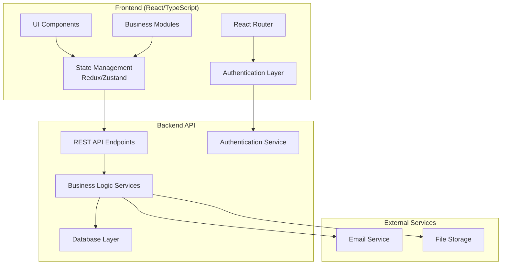

# Design Document

## Overview

The responsive web application is designed as a modern single-page application (SPA) using React with TypeScript. The system follows a component-based architecture with state management, responsive design principles, and modular structure. The application supports role-based access control and provides a consistent user experience across desktop and mobile devices.

## Architecture



The architecture uses:
- **React 18** with functional components and hooks
- **TypeScript** for type safety and better developer experience
- **Responsive CSS** with CSS Grid/Flexbox and media queries
- **State Management** for centralized application state
- **Component Library** for consistent UI elements
- **REST API** for backend communication

## Components and Interfaces

### Authentication System
**Purpose:** Handles user login, session management, and route protection.

**Key Components:**
- `LoginForm` - User authentication interface
- `AuthProvider` - Context provider for authentication state
- `ProtectedRoute` - Route wrapper for authenticated access
- `RoleGuard` - Component-level permission checking

**Authentication Interface:**
```typescript
interface User {
  id: string;
  email: string;
  name: string;
  role: UserRole;
  permissions: Permission[];
  lastLogin?: Date;
}

interface AuthState {
  user: User | null;
  isAuthenticated: boolean;
  isLoading: boolean;
  login: (credentials: LoginCredentials) => Promise<void>;
  logout: () => void;
  checkPermission: (permission: Permission) => boolean;
}

enum UserRole {
  ADMIN = 'admin',
  MANAGER = 'manager',
  TECHNICIAN = 'technician',
  VIEWER = 'viewer'
}
```

### Layout and Navigation
**Purpose:** Provides consistent layout structure and responsive navigation.

**Key Components:**
- `AppLayout` - Main application shell with header, sidebar, and content area
- `Sidebar` - Collapsible navigation menu with role-based filtering
- `Header` - Top navigation with user menu and notifications
- `MobileNav` - Mobile-optimized navigation drawer

**Layout Interface:**
```typescript
interface LayoutProps {
  children: React.ReactNode;
  title?: string;
  breadcrumbs?: BreadcrumbItem[];
  actions?: React.ReactNode;
}

interface MenuItem {
  id: string;
  label: string;
  icon: string;
  path: string;
  requiredPermission?: Permission;
  children?: MenuItem[];
}
```

### Business Module Components
**Purpose:** Reusable components for CRUD operations across all business modules.

**Core Components:**
- `DataTable` - Responsive table with sorting, filtering, and pagination
- `FormModal` - Modal dialog for create/edit operations
- `DetailView` - Detailed view component with tabs and sections
- `SearchFilter` - Advanced search and filtering interface
- `BulkActions` - Multi-select operations for data management

**Generic Interfaces:**
```typescript
interface DataTableProps<T> {
  data: T[];
  columns: ColumnDefinition<T>[];
  loading?: boolean;
  onEdit?: (item: T) => void;
  onDelete?: (item: T) => void;
  onView?: (item: T) => void;
  pagination?: PaginationConfig;
  filters?: FilterConfig[];
}

interface ColumnDefinition<T> {
  key: keyof T;
  label: string;
  sortable?: boolean;
  filterable?: boolean;
  render?: (value: any, item: T) => React.ReactNode;
  responsive?: 'hide-mobile' | 'hide-tablet' | 'always-show';
}
```

### Module-Specific Components

**User Management:**
- `UserList` - User directory with role filtering
- `UserForm` - User creation/editing with role assignment
- `PermissionMatrix` - Visual permission management interface

**Building Management:**
- `BuildingList` - Building directory with location mapping
- `BuildingForm` - Building details with address validation
- `BuildingDetail` - Building overview with equipment associations

**Equipment Management:**
- `EquipmentList` - Equipment inventory with status tracking
- `EquipmentForm` - Equipment specifications and assignments
- `MaintenanceHistory` - Equipment maintenance timeline

**Customer/Vendor Management:**
- `ContactList` - Unified customer/vendor directory
- `ContactForm` - Contact information and business details
- `RelationshipView` - Business relationship tracking

**Meter Management:**
- `MeterList` - Meter inventory with reading status
- `MeterForm` - Meter configuration and assignments
- `ReadingHistory` - Historical meter reading charts

**Settings Management:**
- `CompanyProfile` - Company information and branding
- `SystemSettings` - Application configuration options
- `UserPreferences` - Individual user settings

**Email Templates:**
- `TemplateList` - Email template library
- `TemplateEditor` - Rich text editor with variable support
- `TemplatePreview` - Template rendering with sample data

## Data Models

### Core Entity Models

```typescript
// User Management
interface User {
  id: string;
  email: string;
  name: string;
  role: UserRole;
  status: 'active' | 'inactive';
  lastLogin?: Date;
  createdAt: Date;
  updatedAt: Date;
}

// Building Management
interface Building {
  id: string;
  name: string;
  address: Address;
  contactInfo: ContactInfo;
  status: 'active' | 'inactive';
  equipmentCount: number;
  meterCount: number;
  createdAt: Date;
  updatedAt: Date;
}

// Equipment Management
interface Equipment {
  id: string;
  name: string;
  type: string;
  buildingId: string;
  specifications: Record<string, any>;
  status: 'operational' | 'maintenance' | 'offline';
  installDate: Date;
  lastMaintenance?: Date;
  createdAt: Date;
  updatedAt: Date;
}

// Customer/Vendor Management
interface Contact {
  id: string;
  type: 'customer' | 'vendor';
  name: string;
  company?: string;
  email: string;
  phone: string;
  address: Address;
  status: 'active' | 'inactive';
  notes?: string;
  createdAt: Date;
  updatedAt: Date;
}

// Meter Management
interface Meter {
  id: string;
  serialNumber: string;
  type: 'electric' | 'gas' | 'water' | 'other';
  buildingId?: string;
  equipmentId?: string;
  configuration: MeterConfig;
  lastReading?: MeterReading;
  status: 'active' | 'inactive';
  installDate: Date;
  createdAt: Date;
  updatedAt: Date;
}

// Email Templates
interface EmailTemplate {
  id: string;
  name: string;
  subject: string;
  content: string;
  variables: TemplateVariable[];
  category: string;
  usageCount: number;
  createdAt: Date;
  updatedAt: Date;
}

// Company Settings
interface CompanySettings {
  id: string;
  name: string;
  logo?: string;
  address: Address;
  contactInfo: ContactInfo;
  branding: BrandingConfig;
  systemConfig: SystemConfig;
  updatedAt: Date;
}
```

### Supporting Types

```typescript
interface Address {
  street: string;
  city: string;
  state: string;
  zipCode: string;
  country: string;
}

interface ContactInfo {
  email: string;
  phone: string;
  website?: string;
}

interface MeterConfig {
  readingInterval: number;
  units: string;
  multiplier: number;
  registers?: number[];
}

interface MeterReading {
  value: number;
  timestamp: Date;
  quality: 'good' | 'estimated' | 'questionable';
}

interface TemplateVariable {
  name: string;
  description: string;
  type: 'text' | 'number' | 'date' | 'boolean';
  required: boolean;
}
```

## Responsive Design Strategy

### Breakpoint System
```css
/* Mobile First Approach */
:root {
  --mobile: 320px;
  --tablet: 768px;
  --desktop: 1024px;
  --large: 1440px;
}

@media (min-width: 768px) { /* Tablet */ }
@media (min-width: 1024px) { /* Desktop */ }
@media (min-width: 1440px) { /* Large Desktop */ }
```

### Layout Patterns
- **Mobile (< 768px):** Single column, collapsible navigation, card-based layouts
- **Tablet (768px - 1023px):** Two-column layouts, slide-out navigation
- **Desktop (≥ 1024px):** Multi-column layouts, persistent sidebar navigation

### Component Responsiveness
- **DataTable:** Transforms to card layout on mobile with expandable details
- **Forms:** Stack vertically on mobile, horizontal layouts on desktop
- **Navigation:** Hamburger menu on mobile, persistent sidebar on desktop
- **Modals:** Full-screen on mobile, centered dialogs on desktop

## State Management

### Global State Structure
```typescript
interface AppState {
  auth: AuthState;
  ui: UIState;
  users: EntityState<User>;
  buildings: EntityState<Building>;
  equipment: EntityState<Equipment>;
  contacts: EntityState<Contact>;
  meters: EntityState<Meter>;
  templates: EntityState<EmailTemplate>;
  settings: CompanySettings;
}

interface EntityState<T> {
  items: T[];
  loading: boolean;
  error: string | null;
  filters: FilterState;
  pagination: PaginationState;
}

interface UIState {
  sidebarCollapsed: boolean;
  notifications: Notification[];
  modals: ModalState;
}
```

### State Management Patterns
- **Optimistic Updates:** Immediate UI updates with rollback on failure
- **Caching:** Entity caching with TTL and invalidation strategies
- **Normalization:** Normalized state structure for efficient updates
- **Middleware:** Logging, persistence, and API synchronization

## Error Handling

### Error Boundary Strategy
- **Global Error Boundary:** Catches unhandled React errors
- **Route Error Boundaries:** Page-level error handling with fallback UI
- **Component Error Boundaries:** Isolated error handling for critical components

### API Error Handling
- **Network Errors:** Retry logic with exponential backoff
- **Authentication Errors:** Automatic logout and redirect to login
- **Validation Errors:** Field-level error display with user guidance
- **Server Errors:** User-friendly error messages with support contact

### User Feedback
- **Toast Notifications:** Success/error messages with auto-dismiss
- **Loading States:** Skeleton screens and progress indicators
- **Empty States:** Helpful messaging when no data is available
- **Error States:** Clear error messages with recovery actions

## Performance Optimization

### Code Splitting
- **Route-based Splitting:** Lazy load modules on navigation
- **Component Splitting:** Dynamic imports for heavy components
- **Vendor Splitting:** Separate bundles for third-party libraries

### Data Loading
- **Pagination:** Server-side pagination for large datasets
- **Virtual Scrolling:** Efficient rendering of large lists
- **Caching:** HTTP caching and client-side data caching
- **Prefetching:** Predictive data loading for better UX

### Bundle Optimization
- **Tree Shaking:** Remove unused code from bundles
- **Compression:** Gzip/Brotli compression for assets
- **Image Optimization:** WebP format with fallbacks
- **CSS Optimization:** Critical CSS inlining and purging

## Security Considerations

### Authentication Security
- **JWT Tokens:** Secure token storage and refresh mechanisms
- **Session Management:** Automatic logout on inactivity
- **Password Security:** Strong password requirements and hashing
- **Multi-factor Authentication:** Optional 2FA for enhanced security

### Data Security
- **Input Validation:** Client and server-side validation
- **XSS Prevention:** Content sanitization and CSP headers
- **CSRF Protection:** Token-based CSRF prevention
- **Data Encryption:** Sensitive data encryption in transit and at rest

### Access Control
- **Role-based Permissions:** Granular permission system
- **Route Protection:** Authentication and authorization guards
- **API Security:** Secure API endpoints with proper authorization
- **Audit Logging:** User action tracking for security monitoring

## Testing Strategy

### Unit Testing
- **Component Testing:** React Testing Library for component behavior
- **Hook Testing:** Custom hook testing with React Hooks Testing Library
- **Utility Testing:** Pure function testing with Jest
- **State Testing:** State management logic testing

### Integration Testing
- **API Integration:** Mock API responses for integration testing
- **Route Testing:** Navigation and route protection testing
- **Form Testing:** End-to-end form submission testing
- **Authentication Flow:** Login/logout flow testing

### E2E Testing
- **User Workflows:** Critical user journey testing
- **Cross-browser Testing:** Compatibility across major browsers
- **Mobile Testing:** Touch interaction and responsive behavior
- **Performance Testing:** Load time and interaction performance