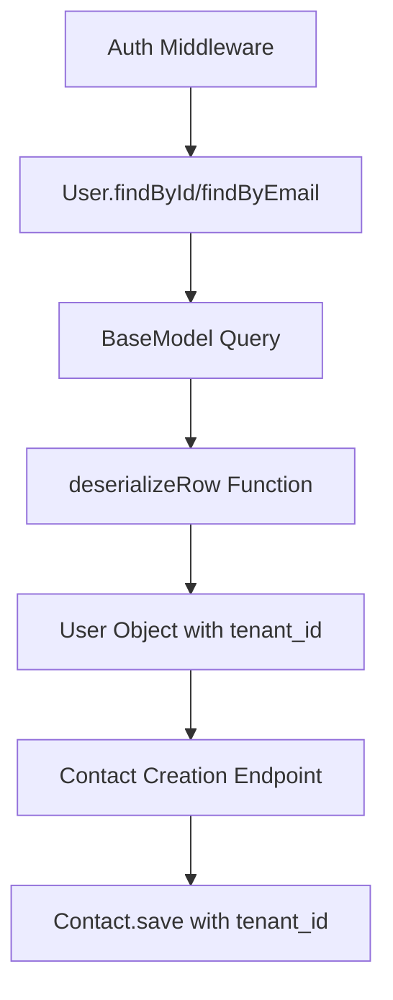

# Design Document: Tenant ID Not Passed to API

## Overview

The tenant ID issue occurs due to a field deserialization problem in the BaseModel framework. When User objects are loaded from the database, the `tenant_id` database column is not being properly mapped to the JavaScript object property, causing contact creation to fail with foreign key constraint violations.

The root cause is in the `deserializeRow` function in `typeHandlers.js`, which correctly maps database columns to object properties using field metadata, but the User model's `tenant_id` field is not being properly processed during deserialization.

## Architecture

The fix involves three components working together:



### Current Flow (Broken)
1. Auth middleware calls `User.findById(decoded.userId)`
2. BaseModel executes SQL query and gets raw database row
3. `deserializeRow` processes the row but doesn't properly map `tenant_id` column
4. User object lacks accessible `tenant_id` property
5. Contact creation fails because `req.user.tenant_id` is undefined

### Fixed Flow
1. Auth middleware calls `User.findById(decoded.userId)`
2. BaseModel executes SQL query and gets raw database row
3. `deserializeRow` properly maps `tenant_id` database column to `tenant_id` property
4. User object has accessible `tenant_id` property
5. Contact creation succeeds with proper tenant isolation

## Components and Interfaces

### 1. Field Deserialization Enhancement

**File**: `framework/backend/shared/utils/typeHandlers.js`

The `deserializeRow` function needs to ensure that when a field has a `dbField` property that matches a database column, the resulting object uses the field's `name` property as the key.

**Current Logic**:
```javascript
// Current: Uses database column name as object key
deserialized[key] = deserializedValue;
```

**Fixed Logic**:
```javascript
// Fixed: Uses field.name as object key when field metadata exists
const propertyName = field.name;
deserialized[propertyName] = deserializedValue;
```

### 2. User Model Field Verification

**File**: `client/backend/src/models/UserWithSchema.js`

The User model already has the correct field definition:
```javascript
tenant_id: field({
    name: 'tenant_id',
    type: FieldTypes.NUMBER,
    default: null,
    readOnly: false,
    label: 'Tenant ID',
    dbField: 'tenant_id',
})
```

This field definition should work correctly once deserialization is fixed.

### 3. Contact Creation Validation

**File**: `client/backend/src/routes/contacts.js`

The contact creation endpoint already has proper validation and tenant_id injection:
```javascript
const tenantId = req.user?.tenant_id;
if (!tenantId) {
    return res.status(400).json({
        success: false,
        message: 'User must have a valid tenant_id to create contacts'
    });
}
```

This validation will work correctly once the User object has the proper `tenant_id` property.

## Data Models

### User Object Structure (After Fix)

```javascript
{
    id: 1,
    name: "Emil Guirguis",
    email: "emilguirguis.eg@gmail.com", 
    role: "admin",
    tenant_id: 1,  // ← This property will be properly available
    active: true,
    permissions: [...],
    // ... other fields
}
```

### Contact Creation Payload (After Fix)

```javascript
{
    name: "Emil Guirguis",
    email: "emilguirguis.eg@gmail.com",
    phone: "7144696168", 
    active: true,
    tenant_id: 1  // ← This will be automatically injected from req.user.tenant_id
}
```

## Correctness Properties

*A property is a characteristic or behavior that should hold true across all valid executions of a system-essentially, a formal statement about what the system should do. Properties serve as the bridge between human-readable specifications and machine-verifiable correctness guarantees.*

### Property 1: User Deserialization Preserves Field Mapping
*For any* User object loaded from the database, the deserialized object should contain a `tenant_id` property that matches the value from the `tenant_id` database column
**Validates: Requirements 1.1, 1.2, 1.3**

### Property 2: Field Metadata Drives Property Names  
*For any* database row with field metadata, the deserialized object should use the field's `name` property as the object key, not the database column name
**Validates: Requirements 2.1, 2.2, 2.3, 2.4**

### Property 3: Contact Creation Inherits Tenant Context
*For any* authenticated user with a valid `tenant_id`, creating a contact should automatically include that `tenant_id` in the contact data
**Validates: Requirements 3.1, 3.2**

### Property 4: Tenant Isolation Enforcement
*For any* contact creation request, the resulting contact should have the same `tenant_id` as the authenticated user
**Validates: Requirements 3.4**

## Error Handling

### 1. Missing Tenant ID Validation
- **Condition**: User object loaded but `tenant_id` is null/undefined
- **Response**: 400 Bad Request with descriptive error message
- **Implementation**: Already exists in contact creation endpoint

### 2. Field Metadata Missing
- **Condition**: Database column exists but no field metadata found
- **Response**: Use column name as-is (current fallback behavior)
- **Implementation**: Preserve existing fallback logic in `deserializeRow`

### 3. Deserialization Failures
- **Condition**: Type conversion fails during deserialization
- **Response**: Log error and use raw value
- **Implementation**: Existing error handling in `deserializeValue`

## Testing Strategy

### Unit Tests
- Test `deserializeRow` function with User field metadata
- Test User model field extraction includes `tenant_id`
- Test contact creation with valid and invalid tenant contexts
- Test field mapping for various field types and dbField configurations

### Property-Based Tests
- **Property 1**: Generate random User database rows and verify `tenant_id` property exists after deserialization (minimum 100 iterations)
- **Property 2**: Generate random field metadata and database rows, verify object keys match field names (minimum 100 iterations)  
- **Property 3**: Generate random authenticated users and verify contact creation includes correct `tenant_id` (minimum 100 iterations)
- **Property 4**: Generate random contact creation scenarios and verify tenant isolation (minimum 100 iterations)

Each property test must reference its design document property using the tag format:
**Feature: tenant-id-not-passed-to-api, Property {number}: {property_text}**

### Integration Tests
- End-to-end contact creation flow with authenticated user
- User authentication and object loading verification
- Multi-tenant isolation verification across different user contexts